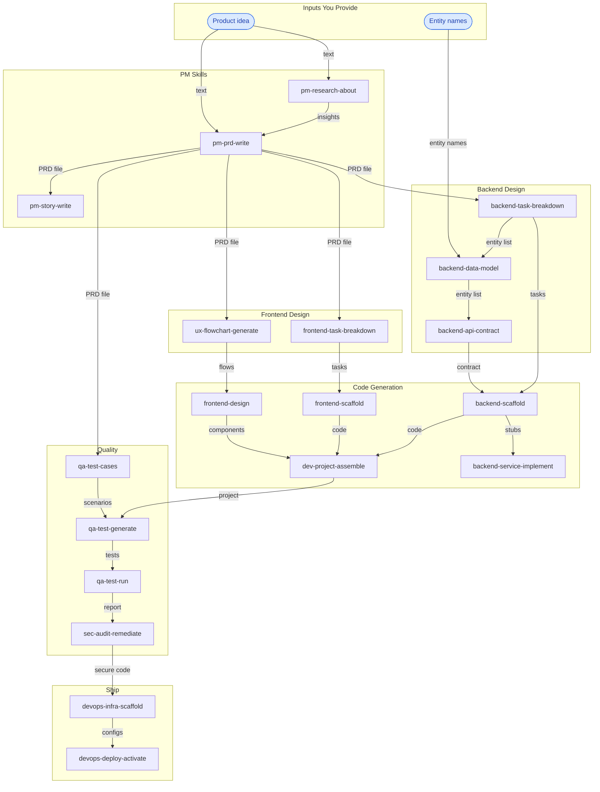
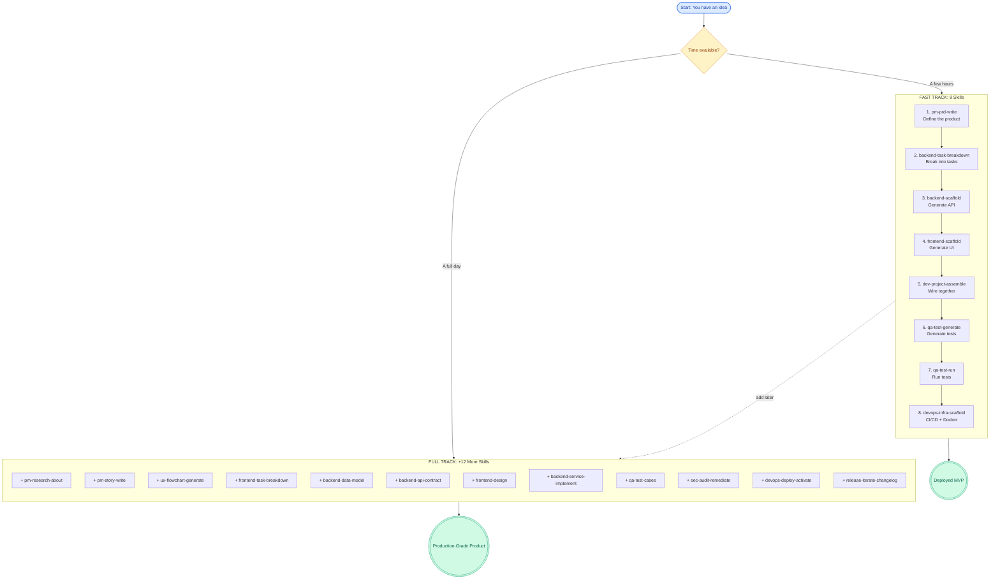

# Idea to Product with jaan-to

## The Best-Fast Path to Ship

> From zero to deployed product. Minimum human intervention — just bring your idea and API keys.

This guide shows the **exact skill sequence** to turn an idea into a deployed, tested, production-ready product using [jaan-to](https://github.com/parhumm/jaan-to). Every command is copy-paste ready. Every output feeds the next skill automatically.

**Two tracks to choose from:**

| Track | Skills | What You Get |
|-------|--------|-------------|
| **Fast Track** | 8 skills | Working code, tests, CI/CD — ship in a day |
| **Full Track** | 20 skills | Research, PRD, stories, designs, BDD tests, security audit, analytics, deployment |

**Real example:** This guide uses [Jaanify](https://github.com/parhumm/jaanify) (AI Task Manager) as the running example — a product built entirely with jaan-to across 11 development cycles.

---

## Prerequisites

1. **Claude Code** installed with an Anthropic API key
2. **jaan-to plugin** installed (`claude install github:parhumm/jaan-to`)
3. **Git repo** initialized for your project
4. That's it. No frameworks to install yet — skills detect and scaffold everything.

---

## How Skills Chain Together

Every jaan-to skill follows a **two-phase pattern**:

```
Phase 1: Analysis (read-only) → asks questions, plans output
                ↓
         HARD STOP → you review and approve [y/n]
                ↓
Phase 2: Generation → writes files to jaan-to/outputs/
```

Skills chain through **file path references**. Each skill writes output to a predictable path, and the next skill reads it:

```
/jaan-to:pm-prd-write "My product idea"
  → writes: jaan-to/outputs/pm/prd/01-my-product/01-my-product.md

/jaan-to:backend-task-breakdown "jaan-to/outputs/pm/prd/01-my-product/01-my-product.md"
  → reads the PRD, writes: jaan-to/outputs/backend/task-breakdown/01-my-product/...
```

**Context files** are the automation multiplier. Set them up once in Phase 0, and every subsequent skill reads them automatically:
- `jaan-to/context/tech.md` — your stack (React, Fastify, PostgreSQL, etc.)
- `jaan-to/context/team.md` — team size, sprint cadence
- `jaan-to/context/boundaries.md` — security rules, write restrictions

---

## Pipeline Overview

### Main Pipeline: 6 Phases from Idea to Deploy

```mermaid
flowchart LR
    %% @generated-by: jaan-to:ux-flowchart-generate
    %% @sources: docs/idea-to-product.md
    %% @generated: 2026-02-16

    %% === NODES ===

    entry_idea([Your Idea])

    subgraph sg_setup ["Phase 0: Setup"]
        step_init[jaan-init]
        data_context[(context files)]
    end

    subgraph sg_define ["Phase 1: Define"]
        step_research[pm-research-about]
        step_prd[pm-prd-write]
        step_stories[pm-story-write]
        data_prd[(PRD)]
    end

    subgraph sg_design ["Phase 2: Design"]
        step_flowchart[ux-flowchart-generate]
        step_be_tasks[backend-task-breakdown]
        step_fe_tasks[frontend-task-breakdown]
        step_data_model[backend-data-model]
        step_api_contract[backend-api-contract]
        data_specs[(Specs + Tasks)]
    end

    subgraph sg_build ["Phase 3: Build"]
        step_be_scaffold[backend-scaffold]
        step_fe_scaffold[frontend-scaffold]
        step_fe_design[frontend-design]
        step_assemble[dev-project-assemble]
        data_code[(Running Code)]
    end

    subgraph sg_quality ["Phase 4: Quality"]
        step_test_cases[qa-test-cases]
        step_test_gen[qa-test-generate]
        step_test_run[qa-test-run]
        step_security[sec-audit-remediate]
        dec_tests_pass{Tests pass?}
    end

    subgraph sg_ship ["Phase 5: Ship"]
        step_infra[devops-infra-scaffold]
        step_deploy[devops-deploy-activate]
        step_changelog[release-iterate-changelog]
    end

    success_live(((Live Product)))

    %% === EDGES: Happy Path ===
    entry_idea -->|start| step_init
    step_init -->|creates| data_context
    data_context -->|feeds| step_research
    step_research -->|insights| step_prd
    step_prd -->|generates| data_prd
    data_prd -->|auto-invoke| step_stories
    data_prd -->|input| step_flowchart
    data_prd -->|input| step_be_tasks
    data_prd -->|input| step_fe_tasks
    step_be_tasks -->|entities| step_data_model
    step_data_model -->|entities| step_api_contract
    step_flowchart -->|diagrams| data_specs
    step_fe_tasks -->|tasks| data_specs
    step_api_contract -->|contract| data_specs
    data_specs -->|input| step_be_scaffold
    data_specs -->|input| step_fe_scaffold
    data_specs -->|input| step_fe_design
    step_be_scaffold -->|code| step_assemble
    step_fe_scaffold -->|code| step_assemble
    step_fe_design -->|components| step_assemble
    step_assemble -->|wires| data_code
    data_prd -->|acceptance criteria| step_test_cases
    data_code -->|input| step_test_gen
    step_test_cases -->|scenarios| step_test_gen
    step_test_gen -->|tests| step_test_run
    step_test_run -->|result| dec_tests_pass
    dec_tests_pass -->|Yes| step_security
    step_security -->|secure code| step_infra
    step_infra -->|CI/CD + Docker| step_deploy
    step_deploy -->|deployed| step_changelog
    step_changelog -->|complete| success_live

    %% === EDGES: Error Paths ===
    dec_tests_pass -.->|No: fix and retry| step_test_run

    %% === STYLES ===
    classDef error fill:#FEE2E2,stroke:#DC2626,color:#991B1B
    classDef success fill:#D1FAE5,stroke:#059669,color:#065F46
    classDef decision fill:#FEF3C7,stroke:#D97706,color:#92400E
    classDef entry fill:#DBEAFE,stroke:#2563EB,color:#1E40AF
    classDef fasttrack fill:#DBEAFE,stroke:#2563EB,stroke-width:3px
    classDef datastore fill:#F3E8FF,stroke:#7C3AED,color:#5B21B6

    class entry_idea entry
    class success_live success
    class dec_tests_pass decision
    class data_context,data_prd,data_specs,data_code datastore
    class step_prd,step_be_tasks,step_be_scaffold,step_fe_scaffold,step_assemble,step_test_gen,step_test_run,step_infra fasttrack
```



> **Blue border** = Fast Track skills (the 8-skill minimum path)

### Skill Dependency Map



### Fast Track vs Full Track



---

## Phase-by-Phase Guide

### Phase 0: Setup (5 minutes)

#### Skill: jaan-init

Initialize the jaan-to workspace in your project.

```bash
/jaan-to:jaan-init
```

**What it creates:**
```
jaan-to/
├── config/settings.yaml    # Plugin configuration
├── context/                # Project context (you fill these)
│   ├── tech.md            # Tech stack
│   ├── team.md            # Team info
│   └── boundaries.md      # Security rules
├── learn/                  # Accumulated lessons
├── outputs/                # All skill outputs go here
└── templates/              # Custom templates (optional)
```

**Your one manual step** — Edit `jaan-to/context/tech.md` with your stack. Example from Jaanify:

```markdown
## Current Stack

### Backend
- **Language**: Node.js (v22.x LTS)
- **Framework**: Fastify v5
- **API Style**: REST + WebSocket

### Frontend
- **Framework**: React v19 with Next.js v15
- **State Management**: Zustand v5
- **Styling**: TailwindCSS v4

### Infrastructure
- **Container**: Docker
- **CI/CD**: GitHub Actions
- **Database**: PostgreSQL 16
```

> Every skill reads this file automatically. Set it up once, benefit everywhere.

> **Fast Track:** Skip (skills still work, just less tailored) | **Full Track:** Do this

---

### Phase 1: Define (30-60 minutes)

This phase turns your idea into structured requirements.

#### Skill 1: pm-research-about

Research your market, competitors, and technical landscape.

```bash
/jaan-to:pm-research-about "AI task management apps 2026 — competitors, pain points, market size"
```

**Questions the skill asks:**
> **What aspect to focus on?** — "Market gaps — specifically AI transparency in task management"
> **Depth level?** — "Comprehensive — include competitor analysis"

**Output:** `jaan-to/outputs/research/01-ai-task-management-market.md`

**Chain to next:** The insights inform your PRD writing.

> **Fast Track:** Skip | **Full Track:** Do this

---

#### Skill 2: pm-prd-write

Generate a complete Product Requirements Document.

```bash
/jaan-to:pm-prd-write "AI Task Manager with natural language input, transparent AI reasoning cards, and 60-second onboarding"
```

**Questions the skill asks:**
> **What problem does this solve?** — "Users don't trust AI task managers — they're black boxes. 84% want explainability."
> **Who is the target user?** — "Freelancers, knowledge workers, ADHD users — people managing their own work"
> **Success metrics?** — "Time-to-first-task <60s, Day 7 retention >40%, Task completion >70%"
> **What's out of scope?** — "Enterprise SSO, team features, native mobile app (MVP is PWA)"

**Output:** `jaan-to/outputs/pm/prd/01-jaanify-mvp/01-jaanify-mvp.md`

Contains: Executive summary, problem statement, solution overview, success metrics, scope, user stories, tech constraints, rollback plan.

**Chain to next:** This PRD feeds 5+ downstream skills directly.

```bash
# The PRD path becomes input for everything in Phase 2:
PRD="jaan-to/outputs/pm/prd/01-jaanify-mvp/01-jaanify-mvp.md"
```

> **Fast Track:** Yes — this is the foundation | **Full Track:** Yes

---

#### Skill 3: pm-story-write

Generate detailed user stories with Given/When/Then acceptance criteria.

```bash
/jaan-to:pm-story-write "jaan-to/outputs/pm/prd/01-jaanify-mvp/01-jaanify-mvp.md"
```

> The skill reads the PRD and auto-extracts stories. `pm-prd-write` even offers to invoke this automatically at the end.

**Output:** 7 story files in `jaan-to/outputs/pm/stories/`:
- `01-natural-language-task-creation/`
- `02-transparent-ai-daily-plan/`
- `03-voice-task-capture/`
- `04-sixty-second-onboarding/`
- `05-reasoning-card-drill-down/`
- `06-task-prioritization-visible-factors/`
- `07-accessibility-neurodivergent-users/`

**Chain to next:** Stories provide acceptance criteria for `qa-test-cases`.

> **Fast Track:** Skip | **Full Track:** Do this

---

### Phase 2: Design (1-2 hours)

This phase breaks the PRD into technical specifications. Skills in this phase can run in parallel.

#### Skill 4: ux-flowchart-generate

Generate user flow diagrams as GitHub-renderable Mermaid.

```bash
/jaan-to:ux-flowchart-generate prd "jaan-to/outputs/pm/prd/01-jaanify-mvp/01-jaanify-mvp.md" userflow
```

**Output:** `jaan-to/outputs/ux/diagrams/01-jaanify-mvp-userflows/`
- Mermaid flowcharts with evidence maps
- Confidence scoring on every node
- Unknowns list for gaps

**Chain to next:** Flowcharts inform `frontend-design` and `frontend-task-breakdown`.

> **Fast Track:** Skip | **Full Track:** Do this

---

#### Skill 5: backend-task-breakdown

Convert the PRD into structured backend development tasks.

```bash
/jaan-to:backend-task-breakdown "jaan-to/outputs/pm/prd/01-jaanify-mvp/01-jaanify-mvp.md"
```

**Questions the skill asks:**
> **Slicing strategy?** — "Vertical — feature-complete slices"
> **Export format?** — "Markdown (default)"

**Output:** `jaan-to/outputs/backend/task-breakdown/01-jaanify-mvp/01-jaanify-mvp.md`

Contains: 28 tasks, 7 vertical slices, critical path (8 tasks), 3 parallel tracks, size estimates, dependency graph. Also available as Jira CSV, Linear markdown, or JSON.

**Chain to next:**
```bash
# Entities extracted from task breakdown feed the data model:
/jaan-to:backend-data-model "User, Task, DailyPlan, DailyPlanSlot, UserFeedback, AuditLog, GuestSession"
```

> **Fast Track:** Yes | **Full Track:** Yes

---

#### Skill 6: frontend-task-breakdown

Convert the PRD into frontend component tasks with atomic design levels.

```bash
/jaan-to:frontend-task-breakdown "jaan-to/outputs/pm/prd/01-jaanify-mvp/01-jaanify-mvp.md"
```

**Output:** `jaan-to/outputs/frontend/task-breakdown/01-jaanify-mvp-frontend/01-jaanify-mvp-frontend.md`

Contains: 68 tasks, 26 components (atoms, molecules, organisms, pages), state machines, dependency graph.

**Chain to next:** Tasks feed `frontend-scaffold`.

> **Fast Track:** Skip (frontend-scaffold can work from PRD alone) | **Full Track:** Do this

---

#### Skill 7: backend-data-model

Generate complete database schema with migration notes.

```bash
/jaan-to:backend-data-model "User, Task, DailyPlan, DailyPlanSlot, UserFeedback, AuditLog, GuestSession"
```

**Output:** `jaan-to/outputs/backend/data-model/02-jaanify-data-model/02-jaanify-data-model.md`

Contains: ER diagram (Mermaid), table definitions with constraints/indexes, Prisma schema, migration notes, soft delete strategy, GDPR retention rules.

**Chain to next:**
```bash
# Same entities feed the API contract:
/jaan-to:backend-api-contract "User, Task, DailyPlan, GuestSession"
```

> **Fast Track:** Skip (scaffold generates a basic schema) | **Full Track:** Do this

---

#### Skill 8: backend-api-contract

Generate OpenAPI 3.1 specification with endpoint documentation.

```bash
/jaan-to:backend-api-contract "User, Task, DailyPlan, GuestSession"
```

**Output:**
- `jaan-to/outputs/backend/api-contract/01-jaanify-mvp/api.yaml` — Full OpenAPI spec
- `jaan-to/outputs/backend/api-contract/01-jaanify-mvp/01-jaanify-mvp.md` — Quick-start guide

Contains: 21 endpoints across 6 resource groups, JWT auth scheme, request/response schemas, RFC 9457 error format, pagination, cURL examples.

**Chain to next:** The API contract feeds `backend-scaffold`.

> **Fast Track:** Skip | **Full Track:** Do this

---

### Phase 3: Build (2-4 hours)

This phase generates actual running code.

#### Skill 9: backend-scaffold

Generate production-ready backend code with routes, models, and services.

```bash
/jaan-to:backend-scaffold "jaan-to/outputs/backend/task-breakdown/01-jaanify-mvp/01-jaanify-mvp.md"
```

**Output:** `jaan-to/outputs/backend/scaffold/01-jaanify-mvp/`
- `01-jaanify-mvp-prisma.prisma` — Database schema
- `01-jaanify-mvp-routes.ts` — API route handlers
- `01-jaanify-mvp-schemas.ts` — Zod validation schemas
- `01-jaanify-mvp-services.ts` — Service layer (with TODO stubs)
- `01-jaanify-mvp-middleware.ts` — Auth, error handling, logging
- `01-jaanify-mvp-config.ts` — Environment configuration

**Chain to next:** Scaffold code goes to `dev-project-assemble` for wiring.

> **Fast Track:** Yes | **Full Track:** Yes

---

#### Skill 10: frontend-scaffold

Generate React/Next.js components with TypeScript and API client hooks.

```bash
/jaan-to:frontend-scaffold "jaan-to/outputs/frontend/task-breakdown/01-jaanify-mvp-frontend/01-jaanify-mvp-frontend.md"
```

**Output:** `jaan-to/outputs/frontend/scaffold/01-jaanify-mvp/`
- `01-jaanify-mvp-types.ts` — TypeScript interfaces
- `01-jaanify-mvp-hooks.ts` — TanStack Query hooks
- `01-jaanify-mvp-components.tsx` — React components
- `01-jaanify-mvp-pages.tsx` — Next.js App Router pages
- `01-jaanify-mvp-config.ts` — API client configuration

**Chain to next:** Frontend code goes to `dev-project-assemble`.

> **Fast Track:** Yes | **Full Track:** Yes

---

#### Skill 11: frontend-design

Create interactive, production-grade UI component previews.

```bash
/jaan-to:frontend-design "Jaanify dashboard with task list, reasoning cards, and daily plan sidebar"
```

**Output:** For each screen:
- `01-jaanify-dashboard-preview.html` — Working HTML preview you can open in a browser
- `01-jaanify-dashboard.md` — Implementation guide with component specs

Jaanify generated 3 screens: Dashboard, Task Input, Onboarding.

**Chain to next:** Design specs feed `dev-project-assemble`.

> **Fast Track:** Skip | **Full Track:** Do this

---

#### Skill 12: dev-project-assemble

Wire all scaffold outputs into a runnable project structure.

```bash
/jaan-to:dev-project-assemble
```

> Reads all scaffold outputs automatically. Generates entry points, package.json configs, tsconfig, and wiring code.

**Output:** `jaan-to/outputs/dev/project-assemble/01-jaanify-mvp/01-jaanify-mvp.md`

Contains: Project structure plan, entry point wiring, dependency list, build commands.

**After this, use `dev-output-integrate` to copy generated code into your actual project:**
```bash
/jaan-to:dev-output-integrate
```

Then verify the build:
```bash
/jaan-to:dev-verify
```

> **Fast Track:** Yes | **Full Track:** Yes

---

### Phase 4: Quality (1-2 hours)

#### Skill 13: qa-test-cases

Generate BDD/Gherkin test scenarios from the PRD's acceptance criteria.

```bash
/jaan-to:qa-test-cases "jaan-to/outputs/pm/prd/01-jaanify-mvp/01-jaanify-mvp.md"
```

**Output:** `jaan-to/outputs/qa/cases/01-jaanify-core-flows/01-jaanify-core-flows.md`

Contains: 74 BDD test cases in Gherkin format, quality checklist (10-point), traceability tags (@REQ-{id}), 30%+ negative test coverage.

**Chain to next:** Test cases feed `qa-test-generate`.

> **Fast Track:** Skip (qa-test-generate works from code alone) | **Full Track:** Do this

---

#### Skill 14: qa-test-generate

Generate runnable Vitest and Playwright test files.

```bash
/jaan-to:qa-test-generate "jaan-to/outputs/qa/cases/01-jaanify-core-flows/01-jaanify-core-flows.md"
```

**Output:** `jaan-to/outputs/qa/test-generate/01-jaanify-core-flows/`
- `unit/` — Service-level unit tests
- `integration/` — API endpoint tests
- `e2e/` — Playwright page objects + tests
- `config/` — Vitest + Playwright config
- `fixtures/` — Test data factories

**Chain to next:**
```bash
/jaan-to:qa-test-run
```

> **Fast Track:** Yes | **Full Track:** Yes

---

#### Skill 15: qa-test-run

Execute tests, diagnose failures, and auto-fix simple issues.

```bash
/jaan-to:qa-test-run
```

> Auto-detects test framework from your project. Runs tests, reports results, offers to fix failures.

**Jaanify result:** 77 tests passing on first run after auto-fixes.

> **Fast Track:** Yes | **Full Track:** Yes

---

#### Skill 16: sec-audit-remediate

Run security audit and generate fixes with regression tests.

```bash
/jaan-to:sec-audit-remediate
```

> Reads `detect-dev` findings if available, otherwise scans from scratch. Generates security fixes with test coverage.

> **Fast Track:** Skip | **Full Track:** Do this

---

### Phase 5: Ship (30 minutes)

#### Skill 17: devops-infra-scaffold

Generate CI/CD workflows, Dockerfiles, and deployment configs.

```bash
/jaan-to:devops-infra-scaffold
```

> Auto-detects your stack from `tech.md` and project files.

**Output:** GitHub Actions workflows, Docker Compose, Dockerfiles — all customized to your stack.

**Jaanify generated:**
- CI pipeline (lint, test, build, security scan)
- Health monitoring workflow
- Docker multi-stage build optimized for Node.js + pnpm

> **Fast Track:** Yes | **Full Track:** Yes

---

#### Skill 18: devops-deploy-activate

Activate deployment pipeline with platform provisioning.

```bash
/jaan-to:devops-deploy-activate
```

**Questions the skill asks:**
> **Deployment platform?** — "Railway (API) + Vercel (Web)"
> **Environment?** — "Production"

> Configures platform settings, environment variables, and deployment triggers.

> **Fast Track:** Skip (deploy manually with Docker) | **Full Track:** Do this

---

#### Skill 19: release-iterate-changelog

Generate a changelog with user-impact notes.

```bash
/jaan-to:release-iterate-changelog
```

> Reads git history and generates a structured changelog.

> **Fast Track:** Skip | **Full Track:** Do this

---

## Chaining Quick Reference

| # | Skill | Input | Output Path | Next Skill(s) |
|---|-------|-------|-------------|---------------|
| 0 | `jaan-init` | None | `jaan-to/` directory | Edit `context/tech.md` |
| 1 | `pm-research-about` | Topic text | `jaan-to/outputs/research/01-*/` | `pm-prd-write` |
| 2 | `pm-prd-write` | Idea text | `jaan-to/outputs/pm/prd/01-*/` | 5+ skills read this |
| 3 | `pm-story-write` | PRD path | `jaan-to/outputs/pm/stories/01-*/` | `qa-test-cases` |
| 4 | `ux-flowchart-generate` | PRD path | `jaan-to/outputs/ux/diagrams/01-*/` | `frontend-design` |
| 5 | `backend-task-breakdown` | PRD path | `jaan-to/outputs/backend/task-breakdown/01-*/` | `backend-data-model` |
| 6 | `frontend-task-breakdown` | PRD path | `jaan-to/outputs/frontend/task-breakdown/01-*/` | `frontend-scaffold` |
| 7 | `backend-data-model` | Entity list | `jaan-to/outputs/backend/data-model/01-*/` | `backend-api-contract` |
| 8 | `backend-api-contract` | Entity list | `jaan-to/outputs/backend/api-contract/01-*/` | `backend-scaffold` |
| 9 | `backend-scaffold` | Task breakdown path | `jaan-to/outputs/backend/scaffold/01-*/` | `dev-project-assemble` |
| 10 | `frontend-scaffold` | Task breakdown path | `jaan-to/outputs/frontend/scaffold/01-*/` | `dev-project-assemble` |
| 11 | `frontend-design` | Screen description | `jaan-to/outputs/frontend/design/01-*/` | `dev-project-assemble` |
| 12 | `dev-project-assemble` | Auto-reads scaffolds | `jaan-to/outputs/dev/project-assemble/01-*/` | `dev-output-integrate` |
| 13 | `qa-test-cases` | PRD path | `jaan-to/outputs/qa/cases/01-*/` | `qa-test-generate` |
| 14 | `qa-test-generate` | Test cases path | `jaan-to/outputs/qa/test-generate/01-*/` | `qa-test-run` |
| 15 | `qa-test-run` | Auto-detects | Test results | `sec-audit-remediate` |
| 16 | `sec-audit-remediate` | Auto-reads code | Security fixes | `devops-infra-scaffold` |
| 17 | `devops-infra-scaffold` | Auto-detects stack | CI/CD + Docker files | `devops-deploy-activate` |
| 18 | `devops-deploy-activate` | Infra configs | Platform deployment | `release-iterate-changelog` |
| 19 | `release-iterate-changelog` | Git history | Changelog | Done |

---

## Tips for Minimum Human Intervention

### 1. Context Files Are Your Automation Secret

Set these up once in Phase 0 and every skill reads them automatically:

| File | What to Include | Skills That Read It |
|------|-----------------|---------------------|
| `context/tech.md` | Languages, frameworks, databases, constraints | All backend/frontend skills |
| `context/team.md` | Team size, sprint cadence, roles | PM skills, task breakdowns |
| `context/boundaries.md` | Security rules, write restrictions | All skills |

### 2. Skills Auto-Suggest Next Steps

After every skill completes, it suggests the next skill to run. Just follow the suggestions:

```
"Backend task breakdown complete."
"Recommended next step: /jaan-to:backend-data-model "User, Task, DailyPlan..."
```

### 3. Approval Gates — When to Review Carefully

| Approval Gate | Review Level | Why |
|---------------|-------------|-----|
| PRD scope and metrics | Careful | Defines everything downstream |
| Data model | Careful | Database schema is hard to change |
| Scaffold code | Quick glance | Generated from specs you already approved |
| Test cases | Quick glance | Generated from PRD you already approved |
| CI/CD config | Careful | Affects deployment pipeline |

### 4. Capture Lessons for Better Results

After each skill, if something could be improved:

```bash
/jaan-to:learn-add "pm-prd-write" "Always ask about password requirements for auth features"
```

Lessons are loaded automatically on future runs, making each execution better than the last.

### 5. Parallel Execution Opportunities

These skills can run in the same session simultaneously:
- `backend-task-breakdown` + `frontend-task-breakdown` (both read PRD)
- `backend-scaffold` + `frontend-scaffold` (both read task breakdowns)
- `qa-test-cases` can start as soon as PRD exists (doesn't need code)

---

## Real-World Example: Jaanify

Jaanify was built entirely with jaan-to across 11 development cycles. Here's the condensed path:

| Cycle | Skills Used | What Was Built |
|-------|------------|----------------|
| 1 | pm-research-about, pm-prd-write, pm-story-write | Market research, MVP PRD, 7 user stories |
| 2 | ux-flowchart-generate, backend-task-breakdown, frontend-task-breakdown | User flows, 28 backend tasks, 68 frontend tasks |
| 3 | backend-data-model, backend-api-contract | 7-entity PostgreSQL schema, 21-endpoint OpenAPI spec |
| 4-5 | backend-scaffold, frontend-scaffold, frontend-design | Full API code, React components, 3 interactive previews |
| 6-7 | dev-project-assemble, dev-output-integrate | Turborepo monorepo with apps/api and apps/web wired |
| 8-9 | qa-test-cases, qa-test-generate, qa-test-run | 74 BDD cases, runnable tests, 77 tests passing |
| 10 | devops-infra-scaffold, devops-deploy-activate | GitHub Actions CI, Docker, Railway + Vercel config |
| 11 | sec-audit-remediate, dev-verify, release-iterate-changelog | Security fixes, first green build, changelog v0.3.0 |

**Result:**
- Full-stack AI Task Manager (Next.js 15 + Fastify 5 + PostgreSQL 16)
- 42 TypeScript source files (web) + 33 (API)
- 77 tests passing, CI pipeline green
- Docker containerized, deployment configured
- 42 skill scorecards tracking quality

---

## What's Next After Shipping

Once your MVP is live, use these skills to iterate:

| Goal | Skills |
|------|--------|
| Add a new feature | `pm-prd-write` → follow the same pipeline |
| Audit code quality | `detect-dev` → `sec-audit-remediate` |
| Audit UX | `detect-ux` → `ux-research-synthesize` |
| Add analytics | `data-gtm-datalayer` |
| Write docs | `docs-create` |
| Track what's missing | `detect-pack` (consolidates all audits) |

---

*Generated with [jaan-to](https://github.com/parhumm/jaan-to) v6.3.1 | [Jaanify](https://github.com/parhumm/jaanify) project*
