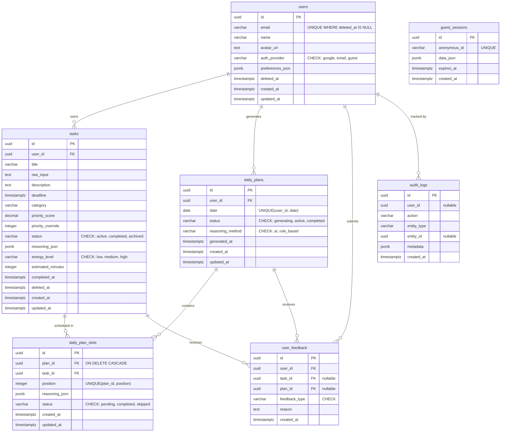

# Jaanify MVP — Data Model

> Generated by jaan.to dev-be-data-model | 2026-02-08

---

## Executive Summary

7-entity data model for Jaanify MVP on PostgreSQL 16 (Supabase) with UUID primary keys, soft deletes on users and tasks, GDPR-compliant retention (audit log anonymization, guest session TTL), and CHECK-on-VARCHAR enum strategy. Greenfield schema with all indexes following ESR composite ordering.

---

## Entity-Relationship Diagram



---

## Table Definitions

### User (`users`)

| Column | Type | Nullable | Default | Constraints |
|--------|------|----------|---------|-------------|
| id | UUID | NO | gen_random_uuid() | PRIMARY KEY |
| email | VARCHAR(255) | YES | — | UNIQUE WHERE deleted_at IS NULL |
| name | VARCHAR(100) | YES | — | — |
| avatar_url | TEXT | YES | — | — |
| auth_provider | VARCHAR(20) | NO | 'guest' | CHECK (auth_provider IN ('google', 'email', 'guest')) |
| preferences_json | JSONB | NO | '{}' | — |
| deleted_at | TIMESTAMPTZ | YES | NULL | — |
| created_at | TIMESTAMPTZ | NO | now() | — |
| updated_at | TIMESTAMPTZ | NO | now() | — |

**Indexes:**

| Name | Columns | Type | Rationale |
|------|---------|------|-----------|
| idx_users_on_email_active | (email) WHERE deleted_at IS NULL | B-tree (partial, unique) | Login lookup; excludes soft-deleted |
| idx_users_on_created_at | (created_at) | B-tree | Admin dashboards, user listing pagination |

**Foreign Keys:**

None (root entity).

**Migration Notes:**

```sql
CREATE TABLE users (
    id UUID PRIMARY KEY DEFAULT gen_random_uuid(),
    email VARCHAR(255),
    name VARCHAR(100),
    avatar_url TEXT,
    auth_provider VARCHAR(20) NOT NULL DEFAULT 'guest'
        CHECK (auth_provider IN ('google', 'email', 'guest')),
    preferences_json JSONB NOT NULL DEFAULT '{}',
    deleted_at TIMESTAMPTZ,
    created_at TIMESTAMPTZ NOT NULL DEFAULT now(),
    updated_at TIMESTAMPTZ NOT NULL DEFAULT now()
);

CREATE UNIQUE INDEX idx_users_on_email_active
    ON users (email) WHERE deleted_at IS NULL;

CREATE INDEX idx_users_on_created_at
    ON users (created_at);
```

---

### Task (`tasks`)

| Column | Type | Nullable | Default | Constraints |
|--------|------|----------|---------|-------------|
| id | UUID | NO | gen_random_uuid() | PRIMARY KEY |
| user_id | UUID | NO | — | FK → users.id ON DELETE RESTRICT |
| title | VARCHAR(500) | NO | — | — |
| raw_input | TEXT | YES | — | — |
| description | TEXT | YES | — | — |
| deadline | TIMESTAMPTZ | YES | — | — |
| category | VARCHAR(100) | YES | — | — |
| priority_score | DECIMAL(5,4) | NO | 0.5000 | CHECK (priority_score BETWEEN 0 AND 1) |
| priority_override | INTEGER | YES | — | CHECK (priority_override BETWEEN 1 AND 5) |
| status | VARCHAR(20) | NO | 'active' | CHECK (status IN ('active', 'completed', 'archived')) |
| reasoning_json | JSONB | YES | — | — |
| energy_level | VARCHAR(10) | YES | — | CHECK (energy_level IN ('low', 'medium', 'high')) |
| estimated_minutes | INTEGER | YES | — | CHECK (estimated_minutes > 0) |
| completed_at | TIMESTAMPTZ | YES | — | — |
| deleted_at | TIMESTAMPTZ | YES | NULL | — |
| created_at | TIMESTAMPTZ | NO | now() | — |
| updated_at | TIMESTAMPTZ | NO | now() | — |

**Indexes:**

| Name | Columns | Type | Rationale |
|------|---------|------|-----------|
| idx_tasks_on_user_status | (user_id, status) WHERE deleted_at IS NULL | B-tree (partial) | ESR: equality (user_id, status) for task list; excludes deleted |
| idx_tasks_on_deadline | (deadline) WHERE deleted_at IS NULL | B-tree (partial) | Range query for upcoming deadlines |
| idx_tasks_on_user_priority | (user_id, priority_score DESC) WHERE deleted_at IS NULL | B-tree (partial) | ESR: equality (user_id) + sort (priority DESC) for AI planner |
| idx_tasks_on_active | (id) WHERE deleted_at IS NULL | B-tree (partial) | Quick active task check |

**Foreign Keys:**

| Column | References | ON DELETE | ON UPDATE |
|--------|-----------|-----------|-----------|
| user_id | users.id | RESTRICT | CASCADE |

**Migration Notes:**

```sql
CREATE TABLE tasks (
    id UUID PRIMARY KEY DEFAULT gen_random_uuid(),
    user_id UUID NOT NULL REFERENCES users(id) ON DELETE RESTRICT ON UPDATE CASCADE,
    title VARCHAR(500) NOT NULL,
    raw_input TEXT,
    description TEXT,
    deadline TIMESTAMPTZ,
    category VARCHAR(100),
    priority_score DECIMAL(5,4) NOT NULL DEFAULT 0.5000
        CHECK (priority_score BETWEEN 0 AND 1),
    priority_override INTEGER
        CHECK (priority_override BETWEEN 1 AND 5),
    status VARCHAR(20) NOT NULL DEFAULT 'active'
        CHECK (status IN ('active', 'completed', 'archived')),
    reasoning_json JSONB,
    energy_level VARCHAR(10)
        CHECK (energy_level IN ('low', 'medium', 'high')),
    estimated_minutes INTEGER
        CHECK (estimated_minutes > 0),
    completed_at TIMESTAMPTZ,
    deleted_at TIMESTAMPTZ,
    created_at TIMESTAMPTZ NOT NULL DEFAULT now(),
    updated_at TIMESTAMPTZ NOT NULL DEFAULT now()
);

CREATE INDEX idx_tasks_on_user_status
    ON tasks (user_id, status) WHERE deleted_at IS NULL;
CREATE INDEX idx_tasks_on_deadline
    ON tasks (deadline) WHERE deleted_at IS NULL;
CREATE INDEX idx_tasks_on_user_priority
    ON tasks (user_id, priority_score DESC) WHERE deleted_at IS NULL;
CREATE INDEX idx_tasks_on_active
    ON tasks (id) WHERE deleted_at IS NULL;
```

---

### DailyPlan (`daily_plans`)

| Column | Type | Nullable | Default | Constraints |
|--------|------|----------|---------|-------------|
| id | UUID | NO | gen_random_uuid() | PRIMARY KEY |
| user_id | UUID | NO | — | FK → users.id ON DELETE CASCADE |
| date | DATE | NO | — | UNIQUE(user_id, date) |
| status | VARCHAR(20) | NO | 'generating' | CHECK (status IN ('generating', 'active', 'completed')) |
| reasoning_method | VARCHAR(20) | NO | 'ai' | CHECK (reasoning_method IN ('ai', 'rule_based')) |
| generated_at | TIMESTAMPTZ | YES | — | — |
| created_at | TIMESTAMPTZ | NO | now() | — |
| updated_at | TIMESTAMPTZ | NO | now() | — |

**Indexes:**

| Name | Columns | Type | Rationale |
|------|---------|------|-----------|
| uq_daily_plans_user_date | (user_id, date) | B-tree (unique) | One plan per user per day — business rule |
| idx_daily_plans_on_user_id | (user_id) | B-tree | FK lookup for user's plan history |

**Foreign Keys:**

| Column | References | ON DELETE | ON UPDATE |
|--------|-----------|-----------|-----------|
| user_id | users.id | CASCADE | CASCADE |

**Migration Notes:**

```sql
CREATE TABLE daily_plans (
    id UUID PRIMARY KEY DEFAULT gen_random_uuid(),
    user_id UUID NOT NULL REFERENCES users(id) ON DELETE CASCADE ON UPDATE CASCADE,
    date DATE NOT NULL,
    status VARCHAR(20) NOT NULL DEFAULT 'generating'
        CHECK (status IN ('generating', 'active', 'completed')),
    reasoning_method VARCHAR(20) NOT NULL DEFAULT 'ai'
        CHECK (reasoning_method IN ('ai', 'rule_based')),
    generated_at TIMESTAMPTZ,
    created_at TIMESTAMPTZ NOT NULL DEFAULT now(),
    updated_at TIMESTAMPTZ NOT NULL DEFAULT now(),
    CONSTRAINT uq_daily_plans_user_date UNIQUE (user_id, date)
);

CREATE INDEX idx_daily_plans_on_user_id
    ON daily_plans (user_id);
```

---

### DailyPlanSlot (`daily_plan_slots`)

| Column | Type | Nullable | Default | Constraints |
|--------|------|----------|---------|-------------|
| id | UUID | NO | gen_random_uuid() | PRIMARY KEY |
| plan_id | UUID | NO | — | FK → daily_plans.id ON DELETE CASCADE |
| task_id | UUID | NO | — | FK → tasks.id ON DELETE RESTRICT |
| position | INTEGER | NO | — | UNIQUE(plan_id, position) |
| reasoning_json | JSONB | YES | — | — |
| status | VARCHAR(20) | NO | 'pending' | CHECK (status IN ('pending', 'completed', 'skipped')) |
| created_at | TIMESTAMPTZ | NO | now() | — |
| updated_at | TIMESTAMPTZ | NO | now() | — |

**Indexes:**

| Name | Columns | Type | Rationale |
|------|---------|------|-----------|
| uq_plan_slots_plan_position | (plan_id, position) | B-tree (unique) | One task per position per plan |
| idx_plan_slots_on_task_id | (task_id) | B-tree | FK lookup — find which plans include a task |

**Foreign Keys:**

| Column | References | ON DELETE | ON UPDATE |
|--------|-----------|-----------|-----------|
| plan_id | daily_plans.id | CASCADE | CASCADE |
| task_id | tasks.id | RESTRICT | CASCADE |

**Migration Notes:**

```sql
CREATE TABLE daily_plan_slots (
    id UUID PRIMARY KEY DEFAULT gen_random_uuid(),
    plan_id UUID NOT NULL REFERENCES daily_plans(id) ON DELETE CASCADE ON UPDATE CASCADE,
    task_id UUID NOT NULL REFERENCES tasks(id) ON DELETE RESTRICT ON UPDATE CASCADE,
    position INTEGER NOT NULL,
    reasoning_json JSONB,
    status VARCHAR(20) NOT NULL DEFAULT 'pending'
        CHECK (status IN ('pending', 'completed', 'skipped')),
    created_at TIMESTAMPTZ NOT NULL DEFAULT now(),
    updated_at TIMESTAMPTZ NOT NULL DEFAULT now(),
    CONSTRAINT uq_plan_slots_plan_position UNIQUE (plan_id, position)
);

CREATE INDEX idx_plan_slots_on_task_id
    ON daily_plan_slots (task_id);
```

---

### UserFeedback (`user_feedback`)

| Column | Type | Nullable | Default | Constraints |
|--------|------|----------|---------|-------------|
| id | UUID | NO | gen_random_uuid() | PRIMARY KEY |
| user_id | UUID | NO | — | FK → users.id ON DELETE CASCADE |
| task_id | UUID | YES | — | FK → tasks.id ON DELETE SET NULL |
| plan_id | UUID | YES | — | FK → daily_plans.id ON DELETE SET NULL |
| feedback_type | VARCHAR(30) | NO | — | CHECK (feedback_type IN ('priority_override', 'plan_override', 'not_now', 'wrong_category', 'other')) |
| reason | TEXT | YES | — | — |
| created_at | TIMESTAMPTZ | NO | now() | — |

**Indexes:**

| Name | Columns | Type | Rationale |
|------|---------|------|-----------|
| idx_feedback_on_user_created | (user_id, created_at) | B-tree | ESR: equality (user_id) + range (created_at) for user feedback history |
| idx_feedback_on_task_id | (task_id) WHERE task_id IS NOT NULL | B-tree (partial) | FK lookup for task-specific feedback |

**Foreign Keys:**

| Column | References | ON DELETE | ON UPDATE |
|--------|-----------|-----------|-----------|
| user_id | users.id | CASCADE | CASCADE |
| task_id | tasks.id | SET NULL | CASCADE |
| plan_id | daily_plans.id | SET NULL | CASCADE |

**Migration Notes:**

```sql
CREATE TABLE user_feedback (
    id UUID PRIMARY KEY DEFAULT gen_random_uuid(),
    user_id UUID NOT NULL REFERENCES users(id) ON DELETE CASCADE ON UPDATE CASCADE,
    task_id UUID REFERENCES tasks(id) ON DELETE SET NULL ON UPDATE CASCADE,
    plan_id UUID REFERENCES daily_plans(id) ON DELETE SET NULL ON UPDATE CASCADE,
    feedback_type VARCHAR(30) NOT NULL
        CHECK (feedback_type IN ('priority_override', 'plan_override', 'not_now', 'wrong_category', 'other')),
    reason TEXT,
    created_at TIMESTAMPTZ NOT NULL DEFAULT now()
);

CREATE INDEX idx_feedback_on_user_created
    ON user_feedback (user_id, created_at);
CREATE INDEX idx_feedback_on_task_id
    ON user_feedback (task_id) WHERE task_id IS NOT NULL;
```

---

### GuestSession (`guest_sessions`)

| Column | Type | Nullable | Default | Constraints |
|--------|------|----------|---------|-------------|
| id | UUID | NO | gen_random_uuid() | PRIMARY KEY |
| anonymous_id | VARCHAR(64) | NO | — | UNIQUE |
| data_json | JSONB | NO | '{}' | — |
| expires_at | TIMESTAMPTZ | NO | — | — |
| created_at | TIMESTAMPTZ | NO | now() | — |

**Indexes:**

| Name | Columns | Type | Rationale |
|------|---------|------|-----------|
| uq_guest_sessions_anon_id | (anonymous_id) | B-tree (unique) | Session lookup by anonymous ID |
| idx_guest_sessions_on_expiry | (expires_at) | B-tree | TTL cleanup query: WHERE expires_at < now() |

**Foreign Keys:**

None (standalone entity — guest data migrated to users table on registration).

**Migration Notes:**

```sql
CREATE TABLE guest_sessions (
    id UUID PRIMARY KEY DEFAULT gen_random_uuid(),
    anonymous_id VARCHAR(64) NOT NULL UNIQUE,
    data_json JSONB NOT NULL DEFAULT '{}',
    expires_at TIMESTAMPTZ NOT NULL,
    created_at TIMESTAMPTZ NOT NULL DEFAULT now()
);

CREATE INDEX idx_guest_sessions_on_expiry
    ON guest_sessions (expires_at);
```

---

### AuditLog (`audit_logs`)

| Column | Type | Nullable | Default | Constraints |
|--------|------|----------|---------|-------------|
| id | UUID | NO | gen_random_uuid() | PRIMARY KEY |
| user_id | UUID | YES | — | No FK (survives user deletion via anonymization) |
| action | VARCHAR(50) | NO | — | — |
| entity_type | VARCHAR(50) | NO | — | — |
| entity_id | UUID | YES | — | — |
| metadata | JSONB | NO | '{}' | — |
| created_at | TIMESTAMPTZ | NO | now() | — |

**Indexes:**

| Name | Columns | Type | Rationale |
|------|---------|------|-----------|
| idx_audit_on_user_created | (user_id, created_at) | B-tree | ESR: equality (user_id) + range (created_at) for user audit trail |
| idx_audit_on_entity | (entity_type, entity_id, created_at) | B-tree | ESR: equality (type, id) + range (created_at) for entity history |

**Foreign Keys:**

None (deliberately no FK to users — audit logs survive user deletion via GDPR anonymization; user_id is set to a sentinel UUID on account deletion).

**Migration Notes:**

```sql
CREATE TABLE audit_logs (
    id UUID PRIMARY KEY DEFAULT gen_random_uuid(),
    user_id UUID,
    action VARCHAR(50) NOT NULL,
    entity_type VARCHAR(50) NOT NULL,
    entity_id UUID,
    metadata JSONB NOT NULL DEFAULT '{}',
    created_at TIMESTAMPTZ NOT NULL DEFAULT now()
);

CREATE INDEX idx_audit_on_user_created
    ON audit_logs (user_id, created_at);
CREATE INDEX idx_audit_on_entity
    ON audit_logs (entity_type, entity_id, created_at);
```

---

## Cross-Cutting Concerns

### Timestamps

All tables include `created_at TIMESTAMPTZ NOT NULL DEFAULT now()`. Tables with mutable data also include `updated_at TIMESTAMPTZ NOT NULL DEFAULT now()` — updated by the application layer (Prisma `@updatedAt` directive).

**Exception**: `user_feedback`, `guest_sessions`, and `audit_logs` are append-only — no `updated_at` column.

### Soft Deletes

Enabled on `users` and `tasks` via `deleted_at TIMESTAMPTZ` (nullable, DEFAULT NULL).

**Enforcement rules**:
- All queries on `users` and `tasks` MUST include `WHERE deleted_at IS NULL` (enforced at repository layer)
- Unique indexes on soft-deleted tables use partial index: `WHERE deleted_at IS NULL`
- Application-layer soft delete sets `deleted_at = now()` (never hard DELETE)
- Hard delete reserved for GDPR right-to-erasure (after grace period)

### Multi-Tenancy

Not applicable — Jaanify MVP is single-tenant SaaS. User isolation is via `user_id` foreign keys, not `tenant_id`.

### Enum Strategy

All enums use `CHECK` constraints on `VARCHAR` columns — no native PostgreSQL ENUM types.

**Rationale** (from learn.md): Cannot remove native ENUM values without aggressive `ALTER TYPE` + table rewrite locks. CHECK constraints can be modified with zero downtime:
```sql
-- Add new value (zero-downtime)
ALTER TABLE tasks DROP CONSTRAINT check_tasks_status_values;
ALTER TABLE tasks ADD CONSTRAINT check_tasks_status_values
    CHECK (status IN ('active', 'completed', 'archived', 'snoozed'));
```

### Primary Key Strategy

UUID v4 via `gen_random_uuid()` (PostgreSQL 13+). Matches Prisma v6 default `@default(uuid())`.

**Trade-offs**: UUIDs are 128-bit vs 64-bit bigint — slightly larger indexes. Acceptable for Jaanify's expected scale (<1M records). Benefit: safe for distributed systems, no sequence coordination.

### Naming Conventions

| Element | Convention | Example |
|---------|-----------|---------|
| Tables | Plural snake_case | `daily_plan_slots` |
| Columns | Singular snake_case | `user_id`, `created_at` |
| PKs | `pk_{table}` | `pk_users` (implicit) |
| FKs | `fk_{table}_{column}_{ref_table}` | `fk_tasks_user_id_users` |
| CHECK | `check_{table}_{column}_{type}` | `check_tasks_status_values` |
| Indexes | `idx_{table}_on_{columns}` | `idx_tasks_on_user_status` |
| Unique | `uq_{table}_{columns}` | `uq_daily_plans_user_date` |

---

## Index Strategy

### Composite Index Ordering (ESR Rule)

All composite indexes follow **Equality → Sort → Range** ordering:

| Index | E (Equality) | S (Sort) | R (Range) | Query Pattern |
|-------|-------------|----------|-----------|---------------|
| `idx_tasks_on_user_status` | user_id, status | — | — | `WHERE user_id = ? AND status = 'active'` |
| `idx_tasks_on_user_priority` | user_id | priority_score DESC | — | `WHERE user_id = ? ORDER BY priority_score DESC` |
| `idx_feedback_on_user_created` | user_id | — | created_at | `WHERE user_id = ? AND created_at > ?` |
| `idx_audit_on_user_created` | user_id | — | created_at | `WHERE user_id = ? AND created_at > ?` |
| `idx_audit_on_entity` | entity_type, entity_id | — | created_at | `WHERE entity_type = ? AND entity_id = ? AND created_at > ?` |

### PostgreSQL-Specific Index Types

| Type | Usage | Tables |
|------|-------|--------|
| **Partial B-tree** | Soft delete exclusion: `WHERE deleted_at IS NULL` | users, tasks |
| **GIN** | JSONB containment queries on reasoning_json | tasks (future, when AI query patterns emerge) |
| **BRIN** | Time-series on audit_logs.created_at (if table grows >10M rows) | audit_logs (future) |

### Soft Delete Partial Indexes

Every index on `users` and `tasks` includes `WHERE deleted_at IS NULL` to:
1. Exclude deleted records from all lookups (correctness)
2. Keep index size proportional to active records (performance)
3. Support `UNIQUE` constraints only on active records (email uniqueness)

---

## Migration Playbook

| Table | Operation | Safety | Method | Notes |
|-------|-----------|--------|--------|-------|
| users | CREATE TABLE | Safe | Instant | New table, no locks |
| tasks | CREATE TABLE | Safe | Instant | New table, depends on users |
| daily_plans | CREATE TABLE | Safe | Instant | New table, depends on users |
| daily_plan_slots | CREATE TABLE | Safe | Instant | New table, depends on daily_plans + tasks |
| user_feedback | CREATE TABLE | Safe | Instant | New table, depends on users + tasks + daily_plans |
| guest_sessions | CREATE TABLE | Safe | Instant | Standalone, no dependencies |
| audit_logs | CREATE TABLE | Safe | Instant | Standalone, no FK constraints |

**Execution order** (respects FK dependencies):
1. `users` (root entity)
2. `tasks` (depends on users)
3. `daily_plans` (depends on users)
4. `daily_plan_slots` (depends on daily_plans, tasks)
5. `user_feedback` (depends on users, tasks, daily_plans)
6. `guest_sessions` (standalone)
7. `audit_logs` (standalone)

**Prisma migration command:**
```bash
npx prisma migrate dev --name init_jaanify_mvp
```

---

## Retention & Compliance

### GDPR Right-to-Erasure

When a user requests account deletion:

1. **Soft delete first** (grace period): `UPDATE users SET deleted_at = now() WHERE id = ?`
2. **After 30-day grace period** — hard deletion process:
   a. **Anonymize audit logs**: `UPDATE audit_logs SET user_id = '00000000-0000-0000-0000-000000000000', metadata = metadata - 'ip' - 'user_agent' WHERE user_id = ?`
   b. **Delete user feedback**: `DELETE FROM user_feedback WHERE user_id = ?`
   c. **Delete tasks** (cascade to plan slots): `DELETE FROM tasks WHERE user_id = ?`
   d. **Delete daily plans** (cascade to slots): `DELETE FROM daily_plans WHERE user_id = ?`
   e. **Hard delete user**: `DELETE FROM users WHERE id = ?`

### Guest Session TTL

Guest sessions expire after 7 days. Cleanup via pg_cron:

```sql
-- Run daily at 03:00 UTC
SELECT cron.schedule('cleanup_expired_guests', '0 3 * * *',
    $$DELETE FROM guest_sessions WHERE expires_at < now()$$
);
```

### Audit Log Retention

- **Active accounts**: Retain indefinitely (audit trail for AI reasoning transparency)
- **Deleted accounts**: Anonymize user_id (sentinel UUID) + strip PII from metadata
- **Archive**: After 1 year, move to cold storage partition (future optimization)

### PII Locations

| Table | PII Columns | Deletion Strategy |
|-------|-------------|-------------------|
| users | email, name, avatar_url, preferences_json | Hard delete after grace period |
| tasks | raw_input (may contain personal details) | Hard delete with user |
| audit_logs | user_id, metadata (may contain IP) | Anonymize (sentinel UUID + strip PII) |
| guest_sessions | anonymous_id, data_json | TTL auto-expire (7 days) |

---

## Quality Scorecard

| Dimension | Weight | Score | Notes |
|-----------|--------|-------|-------|
| Referential Integrity | 25% | 5/5 | All FKs defined with explicit ON DELETE (CASCADE/RESTRICT/SET NULL); FK indexes present on all child tables |
| Constraint Completeness | 25% | 5/5 | CHECK on all enum columns; NOT NULL where appropriate; UNIQUE for email (partial) and user+date; range CHECKs on priority_score, estimated_minutes |
| Index Coverage | 20% | 5/5 | All FK columns indexed; composite indexes follow ESR rule; partial indexes for soft deletes |
| Convention Consistency | 15% | 5/5 | All tables plural snake_case; all columns singular snake_case; consistent constraint naming (idx_, uq_, check_, fk_) |
| Operational Readiness | 15% | 5/5 | Timestamps on all tables; soft delete on users/tasks; GDPR deletion workflow; migration playbook with execution order |
| **Overall** | **100%** | **5.0/5.0** | |

---

## Technical Context

**Stack**: Node.js v22, Fastify v5, Prisma v6, PostgreSQL 16 (Supabase)

**Constraints**: <100ms p95 reads, HTTPS, JWT 1-hour expiry, rate limiting, input sanitization via Prisma

---

## Metadata

| Field | Value |
|-------|-------|
| Generated | 2026-02-08 |
| Output Path | jaan-to/outputs/dev/backend/02-jaanify-data-model/ |
| Skill | /jaan-to:dev-be-data-model |
| jaan-to Version | v3.19.0 |
| Status | Draft |
