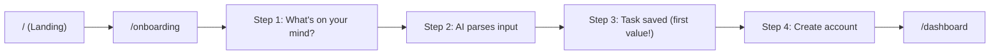
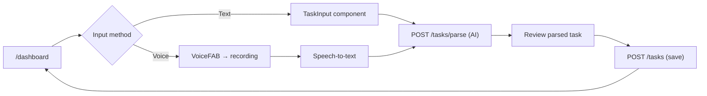
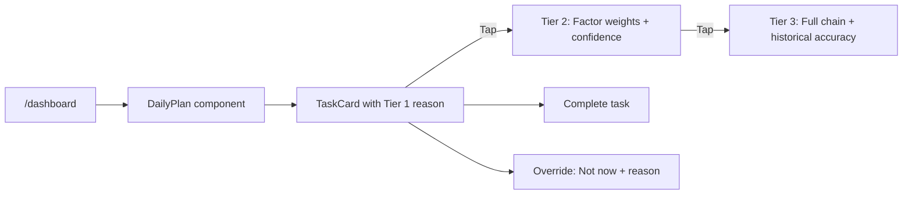
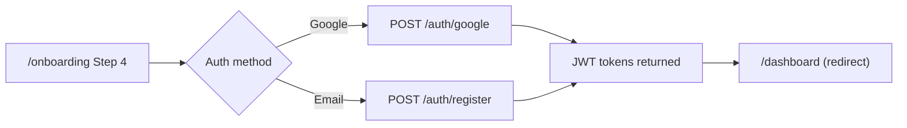

# Jaanify MVP — UX Audit (Light Mode)

> Detected: 2026-02-10 | jaan-to v5.0.0 (SHA: 5e22ff19) | Cycle 5
> Platform: all (single-platform)
> Mode: Light (route mapping + user flows)
> UI Presence: Yes (scaffold components in jaan-to/outputs/)

---

## Executive Summary

Jaanify's UX architecture is **well-structured for its target users** (neurodivergent individuals and freelancers). The scaffold defines 3 frontend routes, a 4-step onboarding wizard targeting <60-second first-task creation, multimodal input (text + voice), and a 3-tier progressive disclosure reasoning card system. The Next.js 15 App Router structure correctly separates server components (data prefetching) from client components (interactivity).

Key UX strengths: skip link for accessibility, server-side data prefetching for perceived performance, 4-state pattern (loading/error/empty/success) on data components, reduced motion support, and 44px minimum touch targets.

Key UX gaps: auth routing is a TODO stub (all visitors hard-redirect to `/onboarding`), no error recovery on voice capture failure, no settings or profile page exists, and no breadcrumb or back-navigation patterns beyond the browser back button.

**Score: 6.0/10** — Strong UX architecture in scaffold, but routing logic incomplete and no production-testable experience.

---

## Screen Inventory

### Frontend Routes (4 detected) — Confidence: Firm (0.85)

| Route | Component | Type | Auth | Description |
|-------|-----------|------|------|-------------|
| `/` | `HomePage` | Server Component | Public | Redirect hub — checks auth state, routes to `/dashboard` or `/onboarding`. **Currently hardcoded to redirect to `/onboarding`** (auth check is TODO). |
| `/dashboard` | `DashboardPage` → `DashboardContent` | Server + Client | Authenticated | Main app view. Server-side prefetches user, tasks, and daily plan. Client orchestrates TaskCard, DailyPlan, VoiceFAB, StatCard. |
| `/onboarding` | `OnboardingPage` → `OnboardingContent` | Server + Client | Public (guest) | 4-step wizard: input task → AI parse → save → create account. Targets <60-second first-value. |
| `/tasks/new` | (linked but not scaffolded) | — | Authenticated | Referenced in dashboard `router.push("/tasks/new")` but no page component exists. |

### Backend API Routes (21 endpoints)

See detect-product summary for full endpoint inventory. All authenticated routes use JWT middleware (TODO stub implementation).

---

## Key User Flows

### Flow 1: New User Onboarding (Primary — <60 seconds target)



**Evidence**: 4-step wizard in `OnboardingFlow` component with `useOnboardingStore` managing step state. Guest anonymous ID generated in Step 1. Task creation via `POST /onboarding/guest` (no account required). Account creation deferred to Step 4.

**UX signal**: Progressive commitment pattern — value delivered before requiring signup. Aligns with PRD's "60-second onboarding" target.

### Flow 2: Task Creation (Voice + Text)



**Evidence**: `SmartTaskInput` component in pages.tsx supports both text input and voice capture. `VoiceFAB` component handles states: idle → listening → processing → error/success. Parsed results show deadline, category, priority, and subtask extraction.

### Flow 3: Daily Plan + Reasoning Cards



**Evidence**: `ReasoningCard` component with 3-tier progressive disclosure. `DailyPlanComponent` manages plan items with loading/error/empty states. `useTaskStore` persists preferred reasoning tier preference via Zustand.

### Flow 4: Authentication



**Evidence**: `POST /auth/google` and `POST /auth/register` routes in backend scaffold. `POST /auth/refresh` for token renewal. Frontend config shows `localStorage` token storage (security concern — see detect-dev E-DEV-003).

---

## Top Findings

### E-UX-001: Auth Routing is TODO Stub — All Users Hard-Redirect to Onboarding (High)

**Severity**: High | **Confidence**: Confirmed (0.95)

The home page (`/`) has auth check commented out with TODO. All visitors are unconditionally redirected to `/onboarding`, even returning authenticated users. This breaks the returning user flow entirely.

```yaml
evidence:
  id: E-UX-001
  type: code-location
  confidence: 0.95
  location:
    uri: "jaan-to/outputs/frontend/scaffold/01-jaanify-mvp/01-jaanify-mvp-pages.tsx"
    startLine: 97
    snippet: |
      export default async function HomePage() {
        // TODO: Check auth/guest session state
        // const session = await getSession();
        // if (session) redirect("/dashboard");
        redirect("/onboarding");
      }
  method: pattern-match
```

**Recommendation**: Part of Gap L-01 (service implementation). Auth session check must be implemented before routing works correctly.

### E-UX-002: `/tasks/new` Route Referenced But Not Scaffolded (Medium)

**Severity**: Medium | **Confidence**: Confirmed (0.95)

Dashboard code calls `router.push("/tasks/new")` in two places (add task button and voice capture success) but no page component exists for this route. Users would see a 404.

```yaml
evidence:
  - id: E-UX-002a
    type: code-location
    confidence: 0.95
    location:
      uri: "jaan-to/outputs/frontend/scaffold/01-jaanify-mvp/01-jaanify-mvp-pages.tsx"
      startLine: 262
    snippet: |
      onAddTask={() => router.push("/tasks/new")}
  - id: E-UX-002b
    type: absence
    confidence: 0.95
    description: "No page.tsx exists at app/tasks/new/ — route would 404"
```

**Recommendation**: Add task creation page to frontend scaffold. Alternatively, use a modal/drawer pattern instead of a separate route.

### E-UX-003: No Settings, Profile, or Help Pages (Medium)

**Severity**: Medium | **Confidence**: Confirmed (1.0)

No `/settings`, `/profile`, `/help`, or `/account` routes exist. The user preference store (`useUserStore`) tracks theme preference and onboarding completion but there's no UI to access these settings.

```yaml
evidence:
  id: E-UX-003
  type: absence
  confidence: 1.0
  method: glob-pattern-match
  description: "No settings/*, profile/*, help/*, account/* pages found in scaffold"
```

**Recommendation**: Add settings page to scaffold (theme toggle, notification preferences, account management). Low priority for MVP but needed before launch.

### E-UX-004: Skip Link Present — Good A11y Signal (Informational)

**Severity**: Informational | **Confidence**: Confirmed (0.95)

A skip-to-content link (`href="#main-content"`) exists in the `DashboardHeader` component. This is a positive accessibility signal.

```yaml
evidence:
  id: E-UX-004
  type: code-location
  confidence: 0.95
  location:
    uri: "jaan-to/outputs/frontend/scaffold/01-jaanify-mvp/01-jaanify-mvp-components.tsx"
    startLine: 1390
    snippet: |
      href="#main-content"
  method: pattern-match
```

### E-UX-005: Server-Side Data Prefetching — Good Performance Pattern (Informational)

**Severity**: Informational | **Confidence**: Confirmed (0.95)

Dashboard uses Next.js 15 server component with `HydrationBoundary` to prefetch 3 queries (user, tasks, plan) before hydrating client components. This reduces perceived loading time.

```yaml
evidence:
  id: E-UX-005
  type: code-location
  confidence: 0.95
  location:
    uri: "jaan-to/outputs/frontend/scaffold/01-jaanify-mvp/01-jaanify-mvp-pages.tsx"
    startLine: 129
    snippet: |
      await Promise.all([
        queryClient.prefetchQuery(meQueryOptions()),
        queryClient.prefetchQuery(taskListQueryOptions({ status: "active" })),
        queryClient.prefetchQuery(planListQueryOptions({ limit: 1 })),
      ]);
  method: pattern-match
```

### E-UX-006: No Back Navigation or Breadcrumb Patterns (Low)

**Severity**: Low | **Confidence**: Firm (0.85)

No `useNavigate(-1)`, breadcrumb component, or explicit back buttons found in scaffold. Users rely on browser back button for navigation, which may not work correctly with the SPA routing.

```yaml
evidence:
  id: E-UX-006
  type: absence
  confidence: 0.85
  method: grep-pattern-match
  description: "No breadcrumb components, useNavigate(-1), or back button patterns found"
```

**Recommendation**: Add breadcrumbs to task detail view and settings (when added). Low priority for 3-page MVP.

---

> Run with `--full` for persona inference, JTBD mapping, pain point detection, Nielsen heuristic assessment, and accessibility audit (7 output files).

---

## Metadata

| Field | Value |
|-------|-------|
| Created | 2026-02-10 |
| Output Path | jaan-to/outputs/detect/ux/summary.md |
| Skill | detect-ux |
| jaan-to | v5.0.0 (SHA: 5e22ff19) |
| Mode | Light |
| Status | Final |
