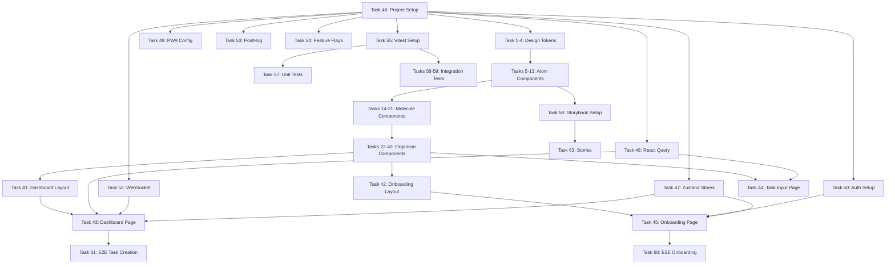

# Jaanify MVP — Frontend Task Breakdown

> Generated by jaan.to | 2026-02-07

---

## Executive Summary

Production-ready frontend task breakdown for Jaanify MVP covering 3 core screens (Dashboard, Task Input, Onboarding) with 26 components across 5 atomic design levels. Includes 68 implementation tasks with state machines, dependency graph, performance budgets (LCP <2s), and WCAG AA accessibility requirements. Tech stack: React v19 / Next.js v15 / TailwindCSS v4 / Zustand v5.

---

## Overview

| Field | Value |
|-------|-------|
| Epic | Jaanify MVP Frontend |
| Feature | Dashboard + Task Input + Onboarding (3 screens) |
| Owner | Solo Developer (AI-assisted via jaan-to) |
| Generated | 2026-02-07 |
| Scope | Production (full states, a11y, performance, edge cases) |

## Tech Stack

- **Language**: TypeScript v5.4
- **Framework**: React v19 with Next.js v15 (App Router)
- **State Management**: Zustand v5
- **Styling**: TailwindCSS v4
- **Server State**: React Query v5
- **Testing**: Vitest v3, Playwright v1.50, Storybook v8
- **Package Manager**: pnpm v9 with Turborepo

## Design References

- Dashboard: `jaan-to/outputs/dev/components/01-jaanify-dashboard/`
- Task Input: `jaan-to/outputs/dev/components/02-jaanify-task-input/`
- Onboarding: `jaan-to/outputs/dev/components/03-jaanify-onboarding/`
- PRD: `jaan-to/outputs/pm/prd/01-jaanify-mvp/01-prd-jaanify-mvp.md`

---

## Component Inventory

| # | Component | Level | Estimate | Reusable | Risk |
|---|-----------|-------|----------|----------|------|
| 1 | Button | Atom | XS | Yes | Low |
| 2 | IconButton | Atom | XS | Yes | Low |
| 3 | TextInput | Atom | S | Yes | Low |
| 4 | Checkbox | Atom | XS | Yes | Low |
| 5 | Badge | Atom | XS | Yes | Low |
| 6 | Chip | Atom | XS | Yes | Low |
| 7 | ProgressDots | Atom | S | Yes | Low |
| 8 | Skeleton | Atom | XS | Yes | Low |
| 9 | ParsedField | Molecule | S | Yes | Low |
| 10 | ReasoningTier1 | Molecule | S | Yes | Medium |
| 11 | SuggestionChips | Molecule | S | No | Low |
| 12 | StatCard | Molecule | S | No | Low |
| 13 | VoiceFAB | Molecule | M | Yes | High |
| 14 | ActionButtons | Molecule | S | Yes | Low |
| 15 | PlanTaskRow | Molecule | S | No | Low |
| 16 | ReasoningCard | Organism | M | Yes | Medium |
| 17 | TaskCard | Organism | M | Yes | Medium |
| 18 | DailyPlan | Organism | M | No | Medium |
| 19 | TaskInputForm | Organism | L | No | High |
| 20 | OnboardingStep | Organism | M | No | Medium |
| 21 | DashboardHeader | Organism | S | No | Low |
| 22 | DashboardLayout | Template | L | No | Low |
| 23 | OnboardingLayout | Template | M | No | Low |
| 24 | DashboardPage | Page | XL | No | Medium |
| 25 | TaskInputPage | Page | L | No | High |
| 26 | OnboardingPage | Page | XL | No | High |

**Summary:**
- Atoms: 8 (7 reusable, 1 new)
- Molecules: 7 (3 reusable, 4 feature-specific)
- Organisms: 6 (3 reusable, 3 feature-specific)
- Templates: 2
- Pages: 3
- **Total: 26 components**

---

## Component Details

### 1. Design Tokens & TailwindCSS Configuration

**Type:** Infrastructure | **Estimate:** M | **Risk:** Low

Extract CSS custom properties from the 3 HTML previews into TailwindCSS v4 theme configuration.

**Tasks:**

| # | Task | Size | Complexity | Dependencies | Acceptance Criteria |
|---|------|------|------------|--------------|---------------------|
| 1 | Configure TailwindCSS v4 theme with Jaanify design tokens | M | Medium | None | All CSS vars from previews mapped to Tailwind tokens: colors (sage, cream, terracotta, gold), typography (DM Sans, fluid clamp scales), spacing, radii, shadows |
| 2 | Set up DM Sans font loading via next/font | XS | Low | None | Font loaded with font-display: swap, no FOUT, fallback font configured |
| 3 | Configure dark mode tokens | S | Medium | Task 1 | prefers-color-scheme: dark theme matches preview dark values, all token pairs defined |
| 4 | Create prefers-reduced-motion utility | XS | Low | None | Utility class disables all transitions/animations when reduced motion preferred |

---

### 2. Button (Atom)

**Type:** Atom | **Estimate:** XS | **Risk:** Low

**States:**

| State | Description | UI Element |
|-------|-------------|------------|
| Default | Idle button | Solid or ghost variant |
| Hover | Mouse over | Subtle background shift |
| Active | Pressed | Slight scale down |
| Disabled | Non-interactive | Muted colors, cursor-not-allowed |
| Loading | Async action | Spinner replaces text |
| Focus | Keyboard focused | Shadow-based focus ring |

**Tasks:**

| # | Task | Size | Complexity | Dependencies | Acceptance Criteria |
|---|------|------|------------|--------------|---------------------|
| 5 | Create Button component with variants (primary, secondary, ghost, danger) | S | Low | Task 1 | All 4 variants render correctly with TailwindCSS classes |
| 6 | Add button states (hover, active, disabled, loading, focus) | XS | Low | Task 5 | All 6 states functional, focus ring visible, loading shows spinner |

---

### 3. IconButton (Atom)

**Type:** Atom | **Estimate:** XS | **Risk:** Low

**Tasks:**

| # | Task | Size | Complexity | Dependencies | Acceptance Criteria |
|---|------|------|------------|--------------|---------------------|
| 7 | Create IconButton component (circle variant for FAB, edit buttons) | XS | Low | Task 5 | Renders icon with accessible label, inherits Button states |

---

### 4. TextInput (Atom)

**Type:** Atom | **Estimate:** S | **Risk:** Low

**States:**

| State | Description | UI Element |
|-------|-------------|------------|
| Default | Empty input | Bottom-line style, placeholder visible |
| Focused | User typing | Underline highlights in sage |
| Filled | Has value | Text visible, placeholder hidden |
| Error | Validation fail | Terracotta underline, error text below |
| Disabled | Non-editable | Muted appearance |

**Tasks:**

| # | Task | Size | Complexity | Dependencies | Acceptance Criteria |
|---|------|------|------------|--------------|---------------------|
| 8 | Create TextInput with auto-resizing textarea variant | S | Medium | Task 1 | Standard input and auto-resize textarea, bottom-line style, all states |

---

### 5. Checkbox (Atom)

**Tasks:**

| # | Task | Size | Complexity | Dependencies | Acceptance Criteria |
|---|------|------|------------|--------------|---------------------|
| 9 | Create Checkbox with completion animation | XS | Low | Task 1 | Sage fill on check, 150ms transition, line-through text on complete |

---

### 6. Badge & Chip (Atoms)

**Tasks:**

| # | Task | Size | Complexity | Dependencies | Acceptance Criteria |
|---|------|------|------------|--------------|---------------------|
| 10 | Create Badge component (priority indicators) | XS | Low | Task 1 | Terracotta/gold/sage variants for high/medium/low priority |
| 11 | Create Chip component (suggestion pills, keyword highlights) | XS | Low | Task 1 | Rounded pill, clickable variant for suggestions, static for keyword highlights |

---

### 7. ProgressDots (Atom)

**Tasks:**

| # | Task | Size | Complexity | Dependencies | Acceptance Criteria |
|---|------|------|------------|--------------|---------------------|
| 12 | Create ProgressDots with active capsule animation | S | Medium | Task 1, Task 4 | Dots indicate steps, active extends to capsule, respects reduced motion |

---

### 8. Skeleton (Atom)

**Tasks:**

| # | Task | Size | Complexity | Dependencies | Acceptance Criteria |
|---|------|------|------------|--------------|---------------------|
| 13 | Create Skeleton shimmer component | XS | Low | Task 1 | Pulse animation, configurable height/width, cream-to-white gradient |

---

### 9. ParsedField (Molecule)

**Type:** Molecule | **Estimate:** S | **Risk:** Low

Used in TaskInput to show each AI-parsed field (deadline, category, priority, subtask).

**Tasks:**

| # | Task | Size | Complexity | Dependencies | Acceptance Criteria |
|---|------|------|------------|--------------|---------------------|
| 14 | Create ParsedField (icon + label + value + edit button) | S | Low | Task 7, Task 1 | Renders icon-led row, edit button toggles inline edit, field updates on blur/enter |

---

### 10. ReasoningTier1 (Molecule)

**Type:** Molecule | **Estimate:** S | **Risk:** Medium

One-line reasoning summary visible on every AI recommendation.

**Tasks:**

| # | Task | Size | Complexity | Dependencies | Acceptance Criteria |
|---|------|------|------------|--------------|---------------------|
| 15 | Create ReasoningTier1 (one-line summary with expand trigger) | S | Medium | Task 1 | Shows reasoning text, click/tap expands to Tier 2, screen reader announces expandable |

---

### 11. SuggestionChips (Molecule)

**Tasks:**

| # | Task | Size | Complexity | Dependencies | Acceptance Criteria |
|---|------|------|------------|--------------|---------------------|
| 16 | Create SuggestionChips row (Call, Remind, Review, Buy) | S | Low | Task 11 | Horizontal scroll on mobile, click fills input, keyboard navigable |

---

### 12. StatCard (Molecule)

**Tasks:**

| # | Task | Size | Complexity | Dependencies | Acceptance Criteria |
|---|------|------|------------|--------------|---------------------|
| 17 | Create StatCard (icon + value + label) | S | Low | Task 1 | 3-card row (tasks completed, focus time, streak), responsive sizing |

---

### 13. VoiceFAB (Molecule)

**Type:** Molecule | **Estimate:** M | **Risk:** High

Floating action button for voice capture with Web Speech API integration.

**States:**

| State | Description | UI Element |
|-------|-------------|------------|
| Default | Idle mic button | Sage circle with mic icon |
| Listening | Recording active | Pulse animation, red indicator |
| Processing | Transcription in progress | Spinner overlay |
| Error | Mic permission denied | Error icon, fallback text input hint |
| Unsupported | Browser lacks Web Speech API | Hidden or disabled with tooltip |

**Tasks:**

| # | Task | Size | Complexity | Dependencies | Acceptance Criteria |
|---|------|------|------------|--------------|---------------------|
| 18 | Create VoiceFAB with Web Speech API integration | M | High | Task 7 | Mic button triggers speech recognition, pulse during listening, visual waveform |
| 19 | Handle voice permission denied and unsupported browser fallback | S | Medium | Task 18 | Graceful degradation: show text input hint, no crash on unsupported browsers |

---

### 14. ActionButtons (Molecule)

**Tasks:**

| # | Task | Size | Complexity | Dependencies | Acceptance Criteria |
|---|------|------|------------|--------------|---------------------|
| 20 | Create ActionButtons pair (Cancel + Save) with staggered animation | S | Low | Task 5, Task 4 | Buttons slide up with 100ms stagger, respects reduced motion |

---

### 15. PlanTaskRow (Molecule)

**Tasks:**

| # | Task | Size | Complexity | Dependencies | Acceptance Criteria |
|---|------|------|------------|--------------|---------------------|
| 21 | Create PlanTaskRow (rank + task + time slot + reasoning trigger) | S | Medium | Task 15, Task 10 | Shows position, task title, scheduled time, tap opens reasoning |

---

### 16. ReasoningCard (Organism)

**Type:** Organism | **Estimate:** M | **Risk:** Medium

3-tier progressive disclosure card — the core differentiator.

**States:**

| State | Description | UI Element |
|-------|-------------|------------|
| Tier1 | Collapsed, one-line | ReasoningTier1 molecule |
| Tier2 | Expanded factors | Factor weight bars, confidence %, override button |
| Tier3 | Full audit | Complete reasoning chain, historical accuracy, adjust weights |
| Loading | Fetching reasoning data | Skeleton bars |
| Error | API failure | "Reasoning unavailable" with retry |

```
State Machine: ReasoningCard
States: collapsed | tier2_expanded | tier3_expanded | loading | error
Events: TOGGLE_T2 | TOGGLE_T3 | FETCH | FETCH_SUCCESS | FETCH_ERROR | RETRY | OVERRIDE

Transitions:
- collapsed --TOGGLE_T2--> tier2_expanded
- tier2_expanded --TOGGLE_T2--> collapsed
- tier2_expanded --TOGGLE_T3--> tier3_expanded (triggers FETCH for audit data)
- tier3_expanded --TOGGLE_T3--> tier2_expanded
- tier3_expanded --TOGGLE_T2--> collapsed
- * --FETCH--> loading
- loading --FETCH_SUCCESS--> tier3_expanded
- loading --FETCH_ERROR--> error
- error --RETRY--> loading
```

**Tasks:**

| # | Task | Size | Complexity | Dependencies | Acceptance Criteria |
|---|------|------|------------|--------------|---------------------|
| 22 | Create ReasoningCard with Tier 1 + Tier 2 expansion | M | High | Task 15 | Click toggles between collapsed/expanded, factor weight bars animate, confidence % shown |
| 23 | Add Tier 3 auditable view with lazy data fetch | S | Medium | Task 22 | "See full reasoning" triggers API call, shows reasoning chain and historical accuracy |
| 24 | Add override action with feedback capture | S | Medium | Task 22 | "Not now" button shows reason options, stores override for AI learning |
| 25 | Persist tier preference per user (Zustand + localStorage) | XS | Low | Task 22, Task 35 | Last-used tier persists across sessions |

---

### 17. TaskCard (Organism)

**Type:** Organism | **Estimate:** M | **Risk:** Medium

**States:**

| State | Description | UI Element |
|-------|-------------|------------|
| Default | Task with reasoning | Checkbox, title, Tier 1 reasoning, priority border |
| Completed | Task checked off | Line-through, muted, checkbox filled |
| Expanded | Reasoning visible | Tier 2 card revealed below |
| Editing | Inline edit mode | Editable title and fields |
| Loading | Saving change | Optimistic UI with spinner |

**Tasks:**

| # | Task | Size | Complexity | Dependencies | Acceptance Criteria |
|---|------|------|------------|--------------|---------------------|
| 26 | Create TaskCard with priority border and reasoning integration | M | Medium | Task 9, Task 22, Task 10 | Priority color border (terracotta/gold/sage), checkbox, title, Tier 1 reasoning |
| 27 | Add task completion with optimistic update | S | Medium | Task 26, Task 36 | Checkbox triggers optimistic completion, rolls back on API failure |
| 28 | Handle long task titles with truncation and tooltip | XS | Low | Task 26 | CSS text-overflow: ellipsis, tooltip on hover for 60+ char titles |

---

### 18. DailyPlan (Organism)

**Type:** Organism | **Estimate:** M | **Risk:** Medium

**States:**

| State | Description | UI Element |
|-------|-------------|------------|
| Default | Plan loaded | Summary card with plan reasoning + task list |
| Loading | Generating plan | Skeleton UI with "AI is planning your day..." |
| Empty | No tasks for today | Illustration + "Add your first task" CTA |
| Error | AI generation failed | "Couldn't generate plan" + fallback chronological list |
| Refreshing | Re-generating after override | Stale plan visible + spinner overlay |

```
State Machine: DailyPlan
States: idle | loading | success | error | empty | refreshing
Events: FETCH | SUCCESS | ERROR | EMPTY | OVERRIDE | REFRESH

Transitions:
- idle --FETCH--> loading
- loading --SUCCESS--> success
- loading --ERROR--> error
- loading --EMPTY--> empty
- success --OVERRIDE--> refreshing (keep stale data visible)
- refreshing --SUCCESS--> success
- refreshing --ERROR--> success (keep previous plan, show toast)
- error --REFRESH--> loading
- empty --FETCH--> loading
```

**Tasks:**

| # | Task | Size | Complexity | Dependencies | Acceptance Criteria |
|---|------|------|------------|--------------|---------------------|
| 29 | Create DailyPlan organism with plan summary and task rows | M | Medium | Task 21, Task 22 | AI plan summary card + reasoning + ordered task list |
| 30 | Add plan loading skeleton UI | S | Low | Task 13, Task 29 | Skeleton matches plan structure, "AI is planning your day..." label |
| 31 | Handle empty state with illustration and CTA | S | Low | Task 29 | Warm illustration, "Add your first task" button links to task input |
| 32 | Handle plan generation error with fallback | S | Medium | Task 29 | Shows error message, falls back to chronological task list |

---

### 19. TaskInputForm (Organism)

**Type:** Organism | **Estimate:** L | **Risk:** High

**States:**

| State | Description | UI Element |
|-------|-------------|------------|
| Default | Empty form | Large textarea, suggestion chips |
| Typing | User entering text | Auto-resize textarea, chips hidden |
| Parsing | AI analyzing text | Dot animation below input |
| Parsed | AI results ready | Enriched card slides up with fields + reasoning |
| Saving | Task being saved | Save button shows spinner |
| Error | Parse or save failure | Error toast, form retains input |
| Voice | Voice input active | Mic pulse, real-time transcription overlay |

```
State Machine: TaskInputForm
States: idle | typing | parsing | parsed | saving | error | voice_listening | voice_processing
Events: INPUT | DEBOUNCE_EXPIRE | PARSE_SUCCESS | PARSE_ERROR | SAVE | SAVE_SUCCESS | SAVE_ERROR | VOICE_START | VOICE_RESULT | VOICE_ERROR | EDIT_FIELD | RESET

Transitions:
- idle --INPUT--> typing
- idle --VOICE_START--> voice_listening
- typing --DEBOUNCE_EXPIRE--> parsing
- typing --INPUT--> typing (reset debounce)
- parsing --PARSE_SUCCESS--> parsed
- parsing --PARSE_ERROR--> error (keep input text)
- parsed --SAVE--> saving
- parsed --EDIT_FIELD--> parsed (update field)
- parsed --INPUT--> typing (re-parse)
- saving --SAVE_SUCCESS--> idle (navigate to dashboard)
- saving --SAVE_ERROR--> error
- voice_listening --VOICE_RESULT--> voice_processing
- voice_listening --VOICE_ERROR--> error
- voice_processing --PARSE_SUCCESS--> parsed
- error --INPUT--> typing
- error --RESET--> idle
```

**Tasks:**

| # | Task | Size | Complexity | Dependencies | Acceptance Criteria |
|---|------|------|------------|--------------|---------------------|
| 33 | Create TaskInputForm with debounced AI parsing (600ms) | L | High | Task 8, Task 16, Task 14 | Textarea auto-resizes, 600ms debounce triggers parse, results slide up |
| 34 | Integrate VoiceFAB into task input with real-time transcription | M | High | Task 18, Task 33 | Voice input fills textarea, triggers parse on completion |
| 35 | Implement parsed result card with editable fields | M | Medium | Task 14, Task 33 | 4 fields (deadline, category, priority, subtask) with inline edit, parsing reasoning |

---

### 20. OnboardingStep (Organism)

**Type:** Organism | **Estimate:** M | **Risk:** Medium

Container for each of the 4 onboarding steps with transition management.

**Tasks:**

| # | Task | Size | Complexity | Dependencies | Acceptance Criteria |
|---|------|------|------------|--------------|---------------------|
| 36 | Create Step 1: "What's on your mind?" with autofocus input | M | Medium | Task 8, Task 5 | Vertically centered input, autofocus, CTA appears after 4+ chars with slide-up |
| 37 | Create Step 2: AI enrichment "aha" moment with Reasoning Card | M | Medium | Task 14, Task 22 | Shows parsed task from Step 1, Reasoning Card with keyword highlights |
| 38 | Create Step 3: Daily plan preview with ranked tasks | M | Medium | Task 21, Task 22 | 3+ demo tasks with reasoning, "Plan your day" message |
| 39 | Create Step 4: Soft account prompt (Google OAuth + skip) | S | Low | Task 5 | Google OAuth button, "Skip for now" visible and guilt-free, privacy note |

---

### 21. DashboardHeader (Organism)

**Tasks:**

| # | Task | Size | Complexity | Dependencies | Acceptance Criteria |
|---|------|------|------------|--------------|---------------------|
| 40 | Create DashboardHeader with greeting and date | S | Low | Task 1 | Time-based greeting ("Good morning, {name}"), today's date formatted |

---

### 22-23. Layouts (Templates)

**Tasks:**

| # | Task | Size | Complexity | Dependencies | Acceptance Criteria |
|---|------|------|------------|--------------|---------------------|
| 41 | Create DashboardLayout (single-column, max-width, responsive) | M | Medium | Task 1 | 480px mobile / 640px tablet / 720px desktop, padding, scroll behavior |
| 42 | Create OnboardingLayout with step transitions | M | Medium | Task 12, Task 4 | Step visibility transitions (500ms cubic-bezier), focus management on step change |

---

### 24-26. Pages (Full Integration)

**Tasks:**

| # | Task | Size | Complexity | Dependencies | Acceptance Criteria |
|---|------|------|------------|--------------|---------------------|
| 43 | Build DashboardPage with data fetching (React Query v5) | XL | High | Task 41, Task 29, Task 26, Task 18, Task 40, Task 17 | All organisms composed, server state via React Query, loading/error/empty states |
| 44 | Build TaskInputPage with routing and state management | L | High | Task 33, Task 34 | Route from dashboard, preserves input on back nav, save redirects to dashboard |
| 45 | Build OnboardingPage with step state (Zustand) | XL | High | Task 42, Task 36-39 | 4-step flow with data passing between steps, guest session (7-day localStorage) |

---

## Infrastructure & Cross-Cutting Tasks

| # | Task | Size | Complexity | Dependencies | Acceptance Criteria |
|---|------|------|------------|--------------|---------------------|
| 46 | Set up Next.js v15 project with App Router | M | Medium | None | pnpm create, TypeScript, TailwindCSS v4, folder structure |
| 47 | Configure Zustand v5 stores (tasks, user, onboarding, ui) | M | Medium | Task 46 | 4 stores with TypeScript types, devtools, persistence middleware |
| 48 | Set up React Query v5 with API client | M | Medium | Task 46 | QueryClient, custom hooks for tasks/plans/auth, optimistic update config |
| 49 | Configure PWA (next-pwa / Workbox) with offline shell | M | Medium | Task 46 | Service worker, manifest.json, offline fallback page, add-to-homescreen |
| 50 | Set up next-auth with Google OAuth + guest session | M | High | Task 46 | OAuth flow, JWT tokens, 7-day guest session with localStorage, session upgrade path |
| 51 | Configure API routes proxy (Next.js API routes → Fastify) | S | Medium | Task 46 | /api/v1/ routes proxy to backend, CORS config, error handling |
| 52 | Set up WebSocket client (Socket.io v4) for real-time sync | M | High | Task 46, Task 48 | Socket connection, reconnect logic, task state sync, plan update events |
| 53 | Configure PostHog analytics client | S | Low | Task 46 | Event tracking for success metrics (time-to-first-task, reasoning card expand, etc.) |
| 54 | Configure feature flags (ENABLE_REASONING_CARDS, ENABLE_VOICE_INPUT, ENABLE_GUEST_MODE) | S | Low | Task 46 | Environment variable-based flags, components check before rendering |

---

## Testing Tasks

| # | Task | Size | Complexity | Dependencies | Acceptance Criteria |
|---|------|------|------------|--------------|---------------------|
| 55 | Set up Vitest v3 with React Testing Library | S | Low | Task 46 | Test runner configured, component test utilities, coverage threshold |
| 56 | Set up Storybook v8 with TailwindCSS v4 | M | Medium | Task 46, Task 1 | Storybook running, theme applied, auto-docs configured |
| 57 | Write unit tests for atom components | M | Medium | Tasks 5-13, Task 55 | All atoms have tests for variants, states, and accessibility |
| 58 | Write integration tests for ReasoningCard (all 3 tiers) | M | High | Task 22-25, Task 55 | Tier transitions, data fetch, override action, tier persistence |
| 59 | Write integration tests for TaskInputForm (parse flow) | M | High | Task 33, Task 55 | Type → debounce → parse → display → edit → save full flow |
| 60 | Write E2E test for onboarding flow (Playwright) | M | High | Task 45 | Step 1→2→3→4 with task data carryover, guest session created |
| 61 | Write E2E test for task creation happy path (Playwright) | M | High | Task 44 | Dashboard → create → type → AI parse → save → back to dashboard |
| 62 | Set up axe-core accessibility automated testing | S | Low | Task 55 | Auto-run on all Storybook stories, zero critical violations |
| 63 | Create Storybook stories for all reusable components | M | Medium | Task 56, Tasks 5-25 | Stories for Button, TextInput, Checkbox, Badge, Chip, ReasoningCard, TaskCard, VoiceFAB |

---

## Accessibility Tasks

| # | Task | Size | Complexity | Dependencies | Acceptance Criteria |
|---|------|------|------------|--------------|---------------------|
| 64 | Add skip navigation link to dashboard | XS | Low | Task 41 | "Skip to main content" link, visible on focus |
| 65 | Implement focus management for step transitions (onboarding) | S | Medium | Task 42 | Focus moves to step heading on transition, announced by screen reader |
| 66 | Add ARIA landmarks to all page layouts | XS | Low | Tasks 41-42 | nav, main, aside roles on appropriate elements |
| 67 | Ensure heading hierarchy (h1 > h2 > h3) across all pages | XS | Low | Tasks 43-45 | No heading level skips, single h1 per page |
| 68 | Screen reader support for ReasoningCard expansion | S | Medium | Task 22 | aria-expanded, aria-controls, live region announces tier content |

---

## Dependency Graph



**Critical Path:** Project Setup → Design Tokens → Atoms → Molecules → Organisms → Layouts → Pages → E2E Tests (8 sequential levels)

**Parallel Tracks:**
1. **Track A (UI Components):** Tokens → Atoms → Molecules → Organisms → Pages
2. **Track B (Infrastructure):** Project Setup → Stores + React Query + Auth + WebSocket + PWA (all parallel)
3. **Track C (Testing):** Vitest + Storybook setup (parallel to Track A atoms)
4. **Track D (Accessibility):** Tasks 64-68 (parallel to page assembly)

---

## Performance Budget

| Metric | Target | Optimization Tasks |
|--------|--------|--------------------|
| LCP | ≤2.0s (per PRD) | next/font for DM Sans with priority preload, critical CSS inlined by Next.js, above-fold components SSR |
| INP | ≤200ms | useTransition for reasoning card expansion, debounced input handlers (600ms), non-blocking state updates |
| CLS | ≤0.1 | Explicit dimensions on stat cards and task cards, aspect-ratio on illustrations, font-display: swap |
| Bundle (initial) | <150kb gzip | Route-level code splitting (App Router), dynamic import for Tier 3 reasoning, tree-shake unused Tailwind |
| Bundle (per-route) | <50kb gzip | Dashboard, TaskInput, Onboarding as separate route chunks |
| TTI | <3.5s on 3G | Service worker pre-caches app shell, skeleton UI for data-dependent sections |

---

## Risk Register

| # | Risk | Category | Likelihood | Impact | Mitigation |
|---|------|----------|------------|--------|------------|
| 1 | API contracts undefined (backend not built yet) | Integration | High | High | Define mock API responses from PRD acceptance criteria, use MSW (Mock Service Worker) for development. Mock data matches PRD task schema. |
| 2 | Web Speech API browser support gaps | Technical | Medium | Medium | Feature flag ENABLE_VOICE_INPUT, graceful fallback to text input with hint message, test on Chrome/Edge (supported) and Safari/Firefox (limited). |
| 3 | OpenAI API latency exceeds 3s budget for reasoning | Technical | Medium | High | Loading skeletons for reasoning content, progressive disclosure (Tier 1 available instantly from cache, Tier 2-3 lazy loaded), fallback rule-based reasoning. |
| 4 | Reasoning Card complexity causes state management bugs | Technical | Medium | Medium | State machine pattern (defined above) prevents boolean flag explosion, test all state transitions. |
| 5 | PWA offline support conflicts with real-time sync | Technical | Low | Medium | Offline-first for task CRUD (localStorage + sync queue), WebSocket reconnect with state reconciliation. |
| 6 | TailwindCSS v4 breaking changes (new major version) | Technical | Low | Low | Pin exact version in package.json, test design token migration early. |
| 7 | Performance budget exceeded on mobile | Performance | Medium | High | Lighthouse CI in GitHub Actions, code splitting per route, lazy load Tier 3 + Storybook, monitor bundle size per PR. |

---

## Coverage Checklist

### Accessibility — INCLUDED (WCAG 2.1 AA per PRD)

- [x] Skip navigation links (Task 64)
- [x] Focus management after dialogs close (Task 65)
- [x] Visible focus indicators — shadow-based ring (Task 5-6)
- [x] Keyboard navigation, no traps (all interactive components)
- [x] ARIA landmarks (Task 66)
- [x] Screen reader text alternatives (Task 68)
- [x] Heading hierarchy (Task 67)
- [x] Form labels and error announcements (Task 8, Task 33)
- [x] Color contrast WCAG AA 4.5:1 (design tokens enforce)
- [x] Reduced motion support (Task 4)

### Responsive — INCLUDED

- [x] Mobile 360-480px (all components mobile-first)
- [x] Tablet 640-768px (layouts defined)
- [x] Desktop 1024px+ (max-width caps)
- [x] Touch targets 44x44px minimum (buttons, checkboxes)
- [x] No horizontal scroll (single-column layouts)
- [x] 200% zoom reflow (flex layouts)
- [ ] Responsive images — Deferred (no heavy image content in MVP)

### Testing — INCLUDED

- [x] Unit tests for utilities (Task 57)
- [x] Integration tests for interactions (Tasks 58-59)
- [x] E2E tests for critical flows (Tasks 60-61)
- [ ] Visual regression tests — Deferred (add with Chromatic post-MVP)
- [x] Accessibility automated tests (Task 62)
- [ ] Cross-browser testing — Deferred to manual QA pre-launch
- [x] Storybook stories (Task 63)

### Performance — INCLUDED

- [x] Code splitting route-level (Next.js App Router)
- [ ] Image optimization — Deferred (minimal images in MVP)
- [x] Font loading strategy (next/font, Task 2)
- [x] Critical CSS (Next.js SSR handles)
- [x] Bundle size budget (<150kb initial, Task perf budget)
- [x] Core Web Vitals targets (LCP ≤2s, INP ≤200ms, CLS ≤0.1)
- [x] Third-party script management (PostHog async, OpenAI server-side)

### Infrastructure — INCLUDED

- [x] Environment variables for API URLs (Task 51)
- [x] Feature flags (Task 54)
- [ ] Error monitoring (Sentry) — Deferred to pre-launch
- [x] Analytics events (Task 53)
- [ ] CSP headers — Deferred to deployment
- [ ] CORS configuration — Deferred to backend build
- [ ] CI/CD pipeline — Deferred (gap: no jaan-to skill for this)

---

## Definition of Ready

- [x] Visual designs for all screens provided (3 HTML preview components)
- [x] All interaction states designed (state matrices above)
- [x] Responsive designs for required breakpoints (defined in component docs)
- [ ] API contracts defined — NOT READY (backend not built; mock strategy in place)
- [x] Blocking dependencies resolved (all frontend dependencies available)
- [x] Acceptance criteria specific and testable (from PRD user stories)

## Definition of Done

- [ ] All component states implemented
- [ ] Accessibility audit passed (WCAG AA)
- [ ] Performance budget met (Lighthouse ≥90)
- [ ] Tests passing (unit + integration)
- [ ] Cross-browser tested (Chrome, Safari, Firefox)
- [ ] Responsive verified (375px, 768px, 1440px)
- [ ] No console errors or warnings
- [ ] Storybook stories for shared components

---

## Summary

| Category | Count |
|----------|-------|
| Total tasks | 68 |
| Atom tasks | 9 |
| Molecule tasks | 8 |
| Organism tasks | 20 |
| Template tasks | 2 |
| Page tasks | 3 |
| Infrastructure tasks | 9 |
| Testing tasks | 9 |
| Accessibility tasks | 5 |
| Design token tasks | 4 |
| Critical path depth | 8 levels |
| Parallel tracks | 4 |

---

## Metadata

| Field | Value |
|-------|-------|
| Generated | 2026-02-07 |
| Skill | jaan-to-dev-fe-task-breakdown |
| Output Path | jaan-to/outputs/dev/frontend/01-jaanify-mvp-frontend/ |
| Status | Draft |
| Version | 3.0 |
| jaan-to Version | v3.16.2 |
