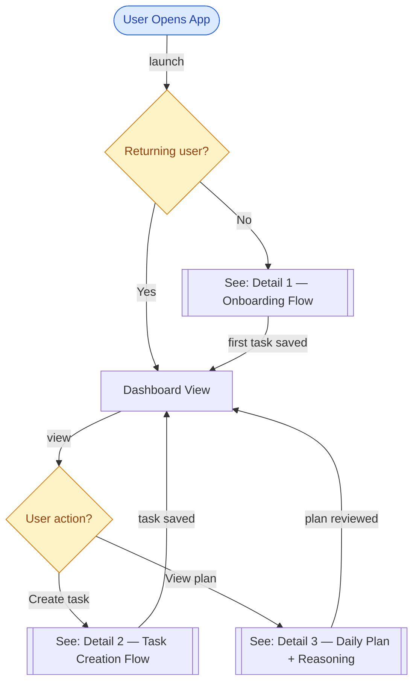
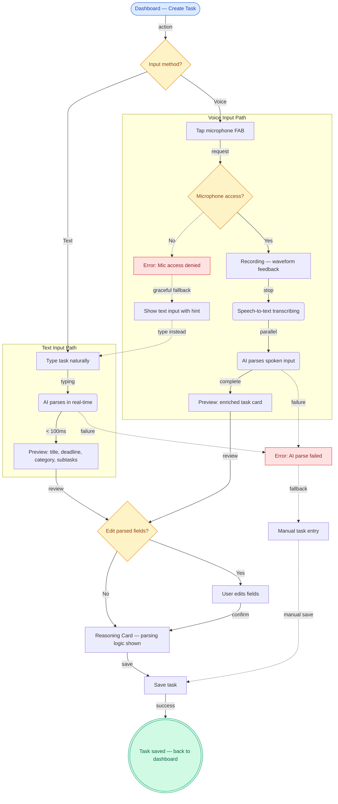
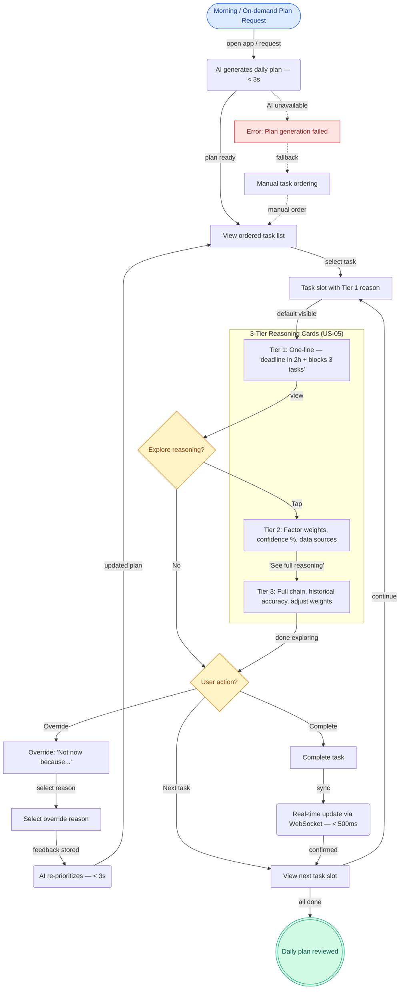

# Jaanify MVP — User Flow Diagrams

> Generated: 2026-02-10 | jaan-to v5.0.0 (SHA: 5e22ff19) | Cycle 5
> Source: PRD (01-jaanify-mvp.md) | Goal: userflow | Scope: All user stories
> Split: 4 diagrams (1 overview + 3 detail) — 38 nodes, 44 edges

---

## Overview: All User Flows

---

## Detail 1: Onboarding Flow (US-04, US-01)

> 60-second onboarding: first task without account creation

```mermaid
flowchart LR
    %% @generated-by: jaan-to:ux-flowchart-generate
    %% @sources: jaan-to/outputs/pm/prd/01-jaanify-mvp/01-jaanify-mvp.md
    %% @generated: 2026-02-10T00:00:00Z
    %% @version: 1.0.0

    %% === NODES ===
    entry_first_visit(["First Visit — No Account"])
    step_whats_on_mind["'What's on your mind?' Input"]
    step_type_task["User types task naturally"]
    load_ai_parse("AI parses input in real-time")
    step_preview_parsed["Preview: title, deadline, category, priority"]
    dec_edit_fields{"Edit parsed fields?"}
    step_edit_fields["User edits fields"]
    step_reasoning_preview["Reasoning Card shown on first task"]
    step_save_first_task["Save first task (no account)"]
    dec_create_account{"Create account?"}
    step_google_oauth["Sign up with Google"]
    step_email_signup["Sign up with email"]
    load_create_account("Creating account...")
    step_skip_account["Continue as guest (7-day session)"]
    success_onboarded((("First task created — Dashboard")))
    err_ai_parse["Error: AI parsing failed"]
    step_manual_entry["Manual task entry fallback"]

    %% === EDGES: Happy Path ===
    entry_first_visit -->|"app opens"| step_whats_on_mind
    step_whats_on_mind -->|"start typing"| step_type_task
    step_type_task -->|"real-time"| load_ai_parse
    load_ai_parse -->|"< 100ms p95"| step_preview_parsed
    step_preview_parsed -->|"review"| dec_edit_fields
    dec_edit_fields -->|"No"| step_reasoning_preview
    dec_edit_fields -->|"Yes"| step_edit_fields
    step_edit_fields -->|"confirm"| step_reasoning_preview
    step_reasoning_preview -->|"save"| step_save_first_task
    step_save_first_task -->|"soft prompt"| dec_create_account
    dec_create_account -->|"Google"| step_google_oauth
    dec_create_account -->|"Email"| step_email_signup
    dec_create_account -->|"Skip"| step_skip_account
    step_google_oauth -->|"OAuth2"| load_create_account
    step_email_signup -->|"submit"| load_create_account
    load_create_account -->|"JWT issued"| success_onboarded
    step_skip_account -->|"guest session"| success_onboarded

    %% === EDGES: Error Paths ===
    load_ai_parse -.->|"parse failure"| err_ai_parse
    err_ai_parse -.->|"fallback"| step_manual_entry
    step_manual_entry -.->|"manual save"| step_reasoning_preview

    %% ===== MANUAL (DO NOT AUTO-EDIT) =====
    %% ===== END MANUAL =====

    %% === STYLES ===
    classDef error fill:#FEE2E2,stroke:#DC2626,color:#991B1B
    classDef success fill:#D1FAE5,stroke:#059669,color:#065F46
    classDef decision fill:#FEF3C7,stroke:#D97706,color:#92400E
    classDef entry fill:#DBEAFE,stroke:#2563EB,color:#1E40AF
    classDef mismatch fill:#FEF3C7,stroke:#DC2626,stroke-width:3px,stroke-dasharray:5 5
    class entry_first_visit entry
    class dec_edit_fields,dec_create_account decision
    class success_onboarded success
    class err_ai_parse error
```

---

## Detail 2: Task Creation — Text + Voice (US-01, US-03)

> Dual-path task creation from dashboard: text input or voice capture

---

## Detail 3: Daily Plan + Reasoning Cards (US-02, US-05, US-06)

> AI daily plan with 3-tier reasoning drill-down and override

---

## Quality Gate Results

| Gate | Status | Notes |
|------|--------|-------|
| SYNTAX_VALID | PASS | All 4 diagrams parse correctly |
| NODE_CAP | PASS | Max 19 nodes per diagram (< 25) |
| EDGE_CAP | PASS | Max 20 edges per diagram (< 50) |
| TEXT_CAP | PASS | Each diagram < 5,000 chars (< 40,000) |
| CYCLOMATIC | PASS | Max 8 per diagram (< 15) |
| NO_ORPHANS | PASS | All nodes appear in edges |
| DECISION_COMPLETE | PASS | All diamonds have 2+ outgoing edges |
| ENTRY_EXISTS | PASS | Each diagram has 1 entry point |
| EXIT_EXISTS | PASS | Each diagram has terminal nodes |
| ERROR_PATHS | PASS | Error paths in all 3 detail diagrams |
| LABELS_PRESENT | PASS | All edges labeled |
| SEMANTIC_IDS | PASS | All IDs match pattern |
| NO_RESERVED | PASS | No "end" node IDs |
| DIRECTION_SET | PASS | TD or LR declared |
| STYLES_DEFINED | PASS | All classDefs present |
| METADATA_PRESENT | PASS | @generated-by, @sources, @generated |
| EVIDENCE_COMPLETE | PASS | See evidence map |

**17/17 gates passed, 0 warnings**

Human-review flags:
- AUDIENCE_FIT: User-facing language throughout (userflow goal)
- ABSTRACTION_CONSISTENT: All nodes at user-action level
- UI_STATES_COMPLETE: Loading states for all async ops (AI parse, plan gen, transcribe)

---

## Unknowns

| ID | Unknown | Impact | Source Gap | Suggested Resolution |
|----|---------|--------|------------|---------------------|
| U1 | Exact Tier 1 reasoning card length (1-line vs 2-line) | Low | PRD Open Question | A/B test after implementation |
| U2 | Auto-generate plan time (fixed 7 AM vs first app open) | Medium | PRD Open Question | Implement configurable trigger |
| U3 | Guest session → account migration data handling | Medium | PRD silent on migration details | Define data merge strategy for guest→auth |
| U4 | Voice "Save"/"Done" command handling in task creation | Low | PRD mentions but no detail | Define voice command vocabulary |
| U5 | Focus Mode flow (US-07) integration with daily plan | Medium | PRD describes but no flow detail | Create separate Focus Mode flowchart |

---

## Metadata

| Field | Value |
|-------|-------|
| Created | 2026-02-10 |
| Output Path | jaan-to/outputs/ux/diagrams/01-jaanify-mvp-userflows/ |
| Skill | ux-flowchart-generate |
| jaan-to | v5.0.0 (SHA: 5e22ff19) |
| Source | PRD (01-jaanify-mvp.md) |
| Goal | userflow |
| Diagrams | 4 (1 overview + 3 detail) |
| Total Nodes | 38 |
| Total Edges | 44 |
